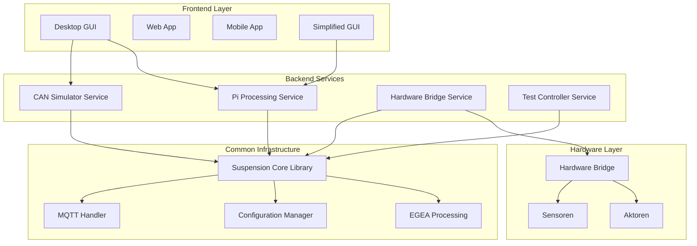

# Shock Tester - Fahrwerkstester-System

> **Modulares System zur EGEA-konformen Dämpfungsprüfung von Fahrzeugfederungen**

## 🎯 Überblick

Dieses System implementiert einen modernen Fahrwerkstester zur Prüfung der Dämpfungseigenschaften von Fahrzeugfederungen
nach **hexagonaler Architektur**. Die Software unterstützt sowohl die **EGEA-konforme Phase-Shift-Methode** als auch das
klassische **Resonanzverfahren**.

### 🏗️ Architekturprinzipien

- **Hexagonale Architektur**: Trennung von Domain-Logik, Application Services und Infrastructure
- **SOLID-Prinzipien**: Single Responsibility, Interface Segregation, Dependency Injection
- **Microservice-Pattern**: Unabhängige Services für verschiedene Aufgaben
- **Event-Driven Communication**: MQTT-basierte lose Kopplung zwischen Komponenten

## 🚀 Kernfunktionen

### 📊 Testmethoden

#### EGEA Phase-Shift-Methode (Primär)

- **Phasenverschiebungsanalyse** zwischen Plattformbewegung und Reifenaufstandskraft
- **SPECSUS2018-konform**: Vollständige Implementierung der EGEA-Spezifikation
- **Bewertungskriterien**: φmin ≥ 35° als "gut" (Dämpfungsgrad ≥ 0.1)
- **Frequenzbereich**: 6-25 Hz mit kontinuierlichem Sweep

#### Resonanzmethode (Fallback)

- **Klassisches Verfahren** mit Ausschwingverhalten-Analyse
- **Kompatibilität** zu bestehenden EUSAMA-Systemen
- **Backup-Methode** für Hardware-Fallback-Szenarien

### 🔧 Protokoll-Unterstützung

| Protokoll          | Baudrate       | Anwendung                               | Status          |
|--------------------|----------------|-----------------------------------------|-----------------|
| **EUSAMA**         | 1 Mbit/s       | Hauptprotokoll (DMS-Sensoren)           | ✅ Implementiert |
| **ASA-Livestream** | 250/125 kBit/s | Alternative (Rollen-/Plattenprüfstände) | ✅ Implementiert |

### 📡 Kommunikation

- **MQTT-Backbone**: Event-driven Kommunikation zwischen Services
- **CAN-Bus-Integration**: Robuste Hardware-Schnittstelle mit Auto-Baudrate-Detection
- **WebSocket** (geplant): Echtzeit-Updates für Web-Frontend

## 🏛️ System-Architektur



## 📁 Projektstruktur

```
shock_tester/
├── 🔧 backend/                    # Backend Services (Hexagon Application Layer)
│   ├── can_simulator_service/     # CAN-Nachrichten-Simulation für Tests
│   ├── pi_processing_service/     # Signal-Processing auf Raspberry Pi
│   ├── hardware_bridge_service/   # Hardware-Abstraktion und -Steuerung
│   └── test_controller_service/   # Test-Orchestrierung und -Management
│
├── 🖥️ frontend/                   # Frontend Applications (Hexagon Adapters)
│   ├── desktop_gui/               # Qt/Tkinter-basierte Desktop-Anwendung
│   ├── web_app/                   # Web-basierte Bedienoberfläche (Dart)
│   └── mobile_app/                # Mobile App für Monitoring (Dart)
│
├── 📚 common/                     # Shared Infrastructure (Hexagon Infrastructure)
│   ├── suspension_core/           # Zentrale Bibliothek
│   │   ├── egea/                  # EGEA-Phase-Shift-Implementierung
│   │   ├── can/                   # CAN-Bus-Abstraktion
│   │   ├── mqtt/                  # MQTT-Kommunikationsschicht
│   │   ├── config/                # Konfigurationsmanagement
│   │   └── protocols/             # Protokoll-Implementierungen
│   ├── mqtt_contracts/            # MQTT-Message-Schemas
│   └── deployment/                # Docker & Ansible-Deployment
│
├── ⚙️ hardware/                   # Hardware Integration (Hexagon Infrastructure)
│   └── enhanced_hardware_bridge.py
│
├── 📖 docs/                       # Technische Dokumentation
│   ├── EGEA Phase_Shift Method for Suspension Testing.pdf
│   └── Fahrwerkstester-Technische Dokumentation v2.0.md
│
├── 🧪 tests/                      # Test-Suite
│   ├── unit/                      # Unit-Tests
│   ├── integration/               # Integration-Tests
│   └── e2e/                       # End-to-End-Tests
│
├── 🚀 scripts/                    # Deployment & Setup-Scripts
│   ├── deploy_pi_service.sh
│   ├── setup_development.sh
│   └── start_system.sh
│
├── 📋 config.yaml                 # Globale System-Konfiguration
├── 🐳 pyproject.toml              # Modern Python Project Configuration
└── 📦 requirements.txt            # Python-Dependencies
```

## 🚀 Schnellstart

### 1. Development Setup

```bash
# Repository klonen
git clone <repository-url>
cd shock_tester

# Python-Umgebung einrichten (uv empfohlen)
uv venv
source .venv/bin/activate  # Linux/Mac
# oder
.venv\Scripts\activate  # Windows

# Dependencies installieren
uv pip install -r requirements.txt

# Common Library im Development-Modus installieren
pip install -e common/suspension_core/
```

### 2. Komponenten starten

#### CAN-Simulator für Entwicklung/Tests

```bash
python -m backend.can_simulator_service.main
```

#### Desktop-GUI

```bash
python frontend/desktop_gui/main.py
```

#### Simplified GUI (Post-Processing)

```bash
python frontend/desktop_gui/simplified_gui.py
```

#### Pi-Processing-Service (Raspberry Pi)

```bash
python -m backend.pi_processing_service.main
```

### 3. System-Integration testen

```bash
# MQTT-Monitor für Debugging
python mqtt_monitor.py

# Vollständiger System-Test
./scripts/start_system.sh
```

## ⚙️ Konfiguration

### Zentrale Konfiguration (`config.yaml`)

```yaml
# System-weite Einstellungen
system:
  mode: "development"  # development, production, testing
  log_level: "INFO"

# MQTT-Broker-Konfiguration
mqtt:
  broker: "localhost"
  port: 1883
  username: null
  password: null

# CAN-Interface-Konfiguration
can:
  interface: "can0"        # Linux: can0, Windows: COM3
  baudrate: 1000000        # 1 Mbit/s für EUSAMA
  protocol: "eusama"       # eusama, asa
  simulator_mode: true     # Für Entwicklung ohne Hardware

# EGEA-Parameter
egea:
  phase_shift_threshold: 35.0  # Mindest-Phasenverschiebung in Grad
  frequency_range:
    min: 6.0   # Hz
    max: 25.0  # Hz

# Hardware-Spezifische Einstellungen
hardware:
  raspberry_pi:
    enable_gpio: true
    sensor_ports:
      weight: "/dev/ttyUSB0"
      position: "/dev/ttyUSB1"
```

### Umgebungsvariablen

```bash
# Überschreibung der Konfiguration
export SHOCK_TESTER_MQTT_BROKER="production-broker.local"
export SHOCK_TESTER_CAN_INTERFACE="can1"
export SHOCK_TESTER_LOG_LEVEL="DEBUG"
```

## 🏗️ Architektur-Details

### Hexagonale Architektur-Implementierung

#### 🎯 Domain Layer (Core Business Logic)

- **`common/suspension_core/egea/`**: EGEA-Algorithmen und Datenmodelle
- **Frei von I/O-Dependencies**: Reine Geschäftslogik ohne externe Abhängigkeiten
- **Testbarkeit**: Isolierte Unit-Tests ohne Mocking von Infrastruktur

#### 🔄 Application Layer (Use Cases)

- **`backend/*/main.py`**: Service-Orchestrierung und Anwendungsfälle
- **Dependency Injection**: Services erhalten ihre Dependencies injiziert
- **Event Handling**: Koordination zwischen Domain und Infrastructure

#### 🔌 Infrastructure Layer (External Concerns)

- **`common/suspension_core/mqtt/`**: MQTT-Kommunikation
- **`common/suspension_core/can/`**: CAN-Bus-Hardware-Anbindung
- **`hardware/`**: Direkte Hardware-Abstraktionen

### Design Patterns

| Pattern        | Implementierung                                   | Zweck                        |
|----------------|---------------------------------------------------|------------------------------|
| **Repository** | `common/suspension_core/config/`                  | Datenzugriff-Abstraktion     |
| **Observer**   | `common/suspension_core/mqtt/`                    | Event-basierte Kommunikation |
| **Strategy**   | `common/suspension_core/egea/processors/`         | Austauschbare Algorithmen    |
| **Factory**    | `common/suspension_core/can/interface_factory.py` | Object-Creation              |
| **Adapter**    | `backend/*/mqtt/`                                 | Legacy-System-Integration    |

## 🧪 Testing-Strategie

### Unit-Tests

```bash
# Core-Bibliothek testen
python -m pytest common/suspension_core/egea/tests/

# Service-spezifische Tests
python -m pytest backend/pi_processing_service/tests/
```

### Integration-Tests

```bash
# MQTT-Integration testen
python -m pytest tests/integration/test_mqtt_integration.py

# End-to-End EGEA-Pipeline
python tests/integration/test_egea_integration.py
```

### Test-Driven Development

```python
# Beispiel: EGEA-Processor Unit-Test
from common.suspension_core.egea.processors import PhaseShiftProcessor


def test_phase_shift_calculation():
	"""Teste Phase-Shift-Berechnung mit bekannten Eingabedaten"""
	processor = PhaseShiftProcessor()

	# Gegeben: Simulierte Messdaten mit bekannter Phasenverschiebung
	time_data = [0.0, 0.1, 0.2, 0.3, 0.4]
	platform_data = [0.0, 1.0, 0.0, -1.0, 0.0]
	force_data = [0.5, 1.0, 0.5, 0.0, -0.5]  # 45° Phasenverschiebung

	# Wenn: Phase-Shift berechnet wird
	result = processor.calculate_phase_shift(time_data, platform_data, force_data)

	# Dann: Erwartete Phasenverschiebung von ~45°
	assert 40 <= result.min_phase_shift <= 50
	assert result.evaluation == "good"  # > 35°
```

## 📊 Service-Kommunikation (MQTT-Topics)

| Topic                          | Richtung              | Beschreibung              | Schema                |
|--------------------------------|-----------------------|---------------------------|-----------------------|
| `suspension/test/start`        | Frontend → Backend    | Test-Start-Kommando       | `TestStartCommand`    |
| `suspension/raw_data/complete` | Hardware → Processing | Vollständige Rohdaten     | `RawMeasurementData`  |
| `suspension/results/processed` | Processing → Frontend | Verarbeitete Ergebnisse   | `ProcessedTestResult` |
| `suspension/system/status`     | All Services          | Service-Status-Updates    | `SystemStatusUpdate`  |
| `suspension/system/heartbeat`  | All Services          | Service-Health-Monitoring | `HeartbeatMessage`    |

## 🔧 Hardware-Requirements

### Minimal-System (Entwicklung)

- **OS**: Windows 10/11, Ubuntu 20.04+, macOS 11+
- **Python**: 3.8+
- **Memory**: 4GB RAM
- **Storage**: 2GB freier Speicherplatz

### Produktions-System (Raspberry Pi)

- **Hardware**: Raspberry Pi 4B (4GB RAM) oder Pi 5
- **OS**: Raspberry Pi OS (64-bit)
- **Storage**: 32GB SD-Karte (Class 10) oder SSD
- **Interfaces**: CAN-HAT, GPIO für Sensoren

### CAN-Hardware

- **Interface**: SocketCAN (Linux) oder Peak PCAN (Windows)
- **Protokoll**: ISO 11898-2 (High-Speed CAN)
- **Terminierung**: 120Ω CAN-Bus-Terminierung erforderlich

### Version 2.0 (Aktuell)

- ✅ Hexagonale Architektur-Migration
- ✅ EGEA-konforme Phase-Shift-Implementierung
- ✅ Microservice-basierte Backend-Services
- ✅ Modernisierte Frontend-Anwendungen

4. **Documentation**: Aktualisieren Sie relevante README-Dateien

### Pull Request Workflow

```bash
# Feature-Branch erstellen
git checkout -b feature/neue-funktionalitaet

# Changes committen
git commit -m "feat: Neue EGEA-Konfiguration hinzugefügt"

# Tests ausführen
python -m pytest

# Pull Request erstellen
```

- **Dokumentation**: `/docs` für technische Details

---

**Version**: 2.0.0  
**Letzte Aktualisierung**: Juni 2025


> **Hinweis**: Dieses System implementiert die EGEA-Spezifikation nach SPECSUS2018 und ist für den produktiven Einsatz
> in der Fahrzeugprüfung konzipiert.