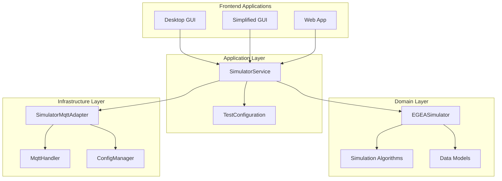

# CAN Simulator Service

> **EGEA-konforme CAN-Bus-Simulation nach hexagonaler Architektur für Entwicklung und Testing**

## 🎯 Überblick

Der CAN Simulator Service ist ein **backend Service** der hexagonalen Architektur, der realistische CAN-Bus-Nachrichten
für EGEA-Suspension-Tests generiert. Er ersetzt die monolithische `raspi_can_simulator.py` durch eine modulare, testbare
und erweiterbare Implementierung.

### 🏗️ Architektur-Rolle



## 🌟 Kern-Features

### ✅ **EGEA-Simulation**

- **Realistische Frequenzsweeps**: 25 Hz → 6 Hz mit kontinuierlicher Degradation
- **Konfigurierbare Dämpfungsqualitäten**: excellent, good, acceptable, poor
- **Phase-Shift-Berechnung**: SPECSUS2018-konforme Algorithmen
- **Protokoll-Unterstützung**: EUSAMA (1 Mbit/s), ASA (250 kBit/s)

### ✅ **Hexagonale Architektur**

- **Domain-Driven Design**: Reine Geschäftslogik ohne I/O-Dependencies
- **Dependency Injection**: Testbare, austauschbare Komponenten
- **Event-Driven Communication**: MQTT-basierte Service-Kommunikation
- **Configuration Management**: Zentrale, validierte Konfiguration

### ✅ **Testing & Development**

- **Endlosmodus**: Kontinuierliche Simulation für Langzeittests
- **Automatische Tests**: Beide Seiten sequenziell oder parallel
- **Performance-Optimierung**: 1000 Hz Sampling-Rate ohne Performance-Loss
- **MQTT-Integration**: Seamlose Integration in das Service-Ecosystem

## 📁 Projektstruktur

```
backend/can_simulator_service/
├── 🚀 main.py                    # Application Layer - Service-Orchestrierung
├── 📋 __main__.py                # CLI-Einstiegspunkt
├── 📋 __init__.py                # Public API & Version
├── 📄 config.yaml                # Service-spezifische Konfiguration
├── 📖 README.md                  # Diese Dokumentation
│
├── 🎯 core/                      # Domain Layer - Reine Geschäftslogik
│   ├── egea_simulator.py         # EGEA-Simulations-Engine
│   ├── config.py                 # Domain-Konfiguration (TestConfiguration)
│   └── algorithms.py             # Signal-Generierungs-Algorithmen
│
├── 📡 mqtt/                      # Infrastructure Layer - MQTT-Integration
│   ├── simulator_adapter.py      # MQTT-Service-Adapter
│   └── message_handlers.py       # Nachrichten-Handler
│
└── ⚙️ config/                    # Configuration Layer
    ├── settings.py               # Service-Settings
    └── simulator_configuration.py # Simulator-Parameter
```

### Architektur-Prinzipien

| Schicht            | Verantwortlichkeit          | Dependencies                |
|--------------------|-----------------------------|-----------------------------|
| **Domain**         | Geschäftslogik, Algorithmen | Keine externen Dependencies |
| **Application**    | Service-Orchestrierung      | Domain + Infrastructure     |
| **Infrastructure** | I/O, MQTT, Konfiguration    | Externe Libraries           |

## 🚀 Installation & Setup

### 1. **Development Setup**

```bash
# Projekt-Root
cd shock_tester/

# Virtual Environment (uv empfohlen)
uv venv
source .venv/bin/activate  # Linux/Mac
# oder
.venv\Scripts\activate     # Windows

# Dependencies installieren
uv pip install -r requirements.txt

# Suspension Core Library
uv pip install -e common/suspension_core/
```

### 2. **Service starten**

```bash
# Direkt ausführen
python backend/can_simulator_service/main.py

# Als Python-Modul
python -m backend.can_simulator_service.main

# Mit spezifischer Konfiguration
python -m backend.can_simulator_service.main --config custom_config.yaml

# Docker (für Produktion)
docker run shock_tester/can_simulator_service:latest
```

### 3. **Systemd Service (Linux/Raspberry Pi)**

```bash
# Service-Datei erstellen
sudo tee /etc/systemd/system/can-simulator.service << EOF
[Unit]
Description=Shock Tester CAN Simulator Service
After=network.target mosquitto.service

[Service]
Type=simple
User=pi
WorkingDirectory=/home/pi/shock_tester
ExecStart=/usr/bin/python -m backend.can_simulator_service.main
Restart=always
RestartSec=10

[Install]
WantedBy=multi-user.target
EOF

# Service aktivieren
sudo systemctl enable can-simulator
sudo systemctl start can-simulator

# Status prüfen
sudo systemctl status can-simulator
```

## ⚙️ Konfiguration

### **Service-Konfiguration** (`config.yaml`)

```yaml
# Service-Identifikation
service:
  name: "can_simulator_service"
  version: "2.0.0"
  environment: "development"  # development, testing, production

# MQTT-Integration
mqtt:
  broker: "localhost"
  port: 1883
  client_id: "can_simulator_service"
  topics:
    commands: "suspension/simulator/command"
    status: "suspension/simulator/status"
    data: "suspension/raw_data/complete"

# Simulator-Konfiguration
simulator:
  protocol: "eusama"              # eusama, asa
  sampling_rate: 1000             # Hz
  message_interval: 0.001         # Sekunden (1000 Hz)

# Test-Parameter
test:
  default_quality: "good"         # excellent, good, acceptable, poor
  frequency_range:
    start: 25.0                   # Hz
    end: 6.0                      # Hz
  duration: 30.0                  # Sekunden

# Endlosmodus
endless_mode:
  enabled: false
  pause_between_tests: 3.0        # Sekunden
  qualities_cycle: [ "excellent", "good", "acceptable", "poor" ]
  sides_cycle: [ "left", "right" ]

# Logging
logging:
  level: "INFO"
  format: "%(asctime)s - %(name)s - %(levelname)s - %(message)s"
  file: "logs/can_simulator.log"
```

### **Umgebungsvariablen**

```bash
# Service-Übersteuerung
export CAN_SIMULATOR_MQTT_BROKER="production-broker.local"
export CAN_SIMULATOR_LOG_LEVEL="DEBUG"
export CAN_SIMULATOR_ENDLESS_MODE="true"
export CAN_SIMULATOR_SAMPLING_RATE="2000"
```

### **Code-Konfiguration**

```python
from backend.can_simulator_service.core.config import TestConfiguration

# Programmatische Konfiguration
config = TestConfiguration(
	protocol="eusama",
	sampling_rate=1000,
	test_duration=30.0,
	endless_mode=True,
	endless_pause=2.0
)

# Service mit Custom-Config starten
from backend.can_simulator_service.main import SimulatorService

service = SimulatorService(config=config, endless_mode=True)
await service.run()
```

## 🔧 Programmatische API

### **Service-Orchestrierung**

```python
import asyncio
from backend.can_simulator_service.main import SimulatorService
from backend.can_simulator_service.core.config import TestConfiguration


async def run_simulator():
	"""Simulator Service programmatisch starten"""

	# Konfiguration erstellen
	config = TestConfiguration(
		protocol="eusama",
		sampling_rate=1000,
		test_duration=30.0
	)

	# Service initialisieren
	service = SimulatorService(
		config=config,
		endless_mode=False,
		auto_test=True
	)

	# Service starten
	await service.initialize()
	await service.run()


# Ausführen
asyncio.run(run_simulator())
```

### **EGEA-Simulator direkt verwenden**

```python
from backend.can_simulator_service.core.egea_simulator import EGEASimulator
from backend.can_simulator_service.core.config import TestConfiguration

# Direct Domain-Access
config = TestConfiguration(quality="good", protocol="eusama")
simulator = EGEASimulator(config=config)

# Simulation starten
await simulator.start_simulation("left", duration=10.0)

# Daten generieren
measurement_data = simulator.generate_measurement_data(
	timestamp=time.time(),
	frequency=15.0,
	position="left"
)

print(f"Phase Shift: {measurement_data.phase_shift:.1f}°")
print(f"Platform Position: {measurement_data.platform_position:.3f}mm")
print(f"Tire Force: {measurement_data.tire_force:.2f}N")
```

### **MQTT-Integration**

```python
from backend.can_simulator_service.mqtt.simulator_adapter import SimulatorMqttAdapter
from suspension_core.mqtt.handler import MqttHandler

# MQTT-Adapter erstellen
mqtt_handler = MqttHandler(broker="localhost", port=1883)
adapter = SimulatorMqttAdapter(
	simulator=simulator,
	mqtt_handler=mqtt_handler
)


# Event-Handler registrieren
@adapter.on_test_command
async def handle_test_start(command):
	"""Behandelt Test-Start-Kommandos über MQTT"""
	print(f"Test starten: {command.position}, Qualität: {command.quality}")
	await simulator.start_simulation(command.position, command.duration)


# MQTT-Integration starten
await adapter.start()
```

## 📊 MQTT-Integration

### **Topic-Schema**

| Topic                          | Richtung  | Beschreibung              | Payload-Typ          |
|--------------------------------|-----------|---------------------------|----------------------|
| `suspension/simulator/command` | ⬇️ Input  | Test-Kommandos empfangen  | `TestCommand`        |
| `suspension/simulator/status`  | ⬆️ Output | Service-Status-Updates    | `ServiceStatus`      |
| `suspension/raw_data/complete` | ⬆️ Output | Generierte Messdaten      | `RawMeasurementData` |
| `suspension/system/heartbeat`  | ⬆️ Output | Service-Health-Monitoring | `HeartbeatMessage`   |

### **Message-Schemas**

#### Test-Kommando

```json
{
  "command": "start",
  "test_id": "test_12345",
  "position": "front_left",
  "quality": "good",
  "parameters": {
    "duration": 30.0,
    "frequency_range": [
      6.0,
      25.0
    ],
    "sampling_rate": 1000
  },
  "timestamp": 1234567890.123
}
```

#### Messdaten-Output

```json
{
  "event": "measurement_data",
  "test_id": "test_12345",
  "position": "front_left",
  "timestamp": 1234567890.123,
  "platform_position": 5.234,
  "tire_force": 487.65,
  "frequency": 15.2,
  "phase_shift": 42.3,
  "metadata": {
    "quality": "good",
    "protocol": "eusama",
    "sampling_rate": 1000
  }
}
```

#### Service-Status

```json
{
  "service": "can_simulator_service",
  "status": "running",
  "uptime": 1234.56,
  "current_test": {
    "test_id": "test_12345",
    "position": "front_left",
    "progress": 0.75,
    "remaining_time": 7.5
  },
  "statistics": {
    "tests_completed": 42,
    "messages_sent": 30000,
    "errors": 0
  },
  "timestamp": 1234567890.123
}
```

## 🧪 Testing & Qualitätssicherung

### **Unit-Tests**

```bash
# Domain-Tests (ohne I/O-Dependencies)
python -m pytest backend/can_simulator_service/core/tests/

# Infrastructure-Tests (mit Mocking)
python -m pytest backend/can_simulator_service/mqtt/tests/

# Integration-Tests
python -m pytest tests/integration/test_can_simulator_integration.py
```

### **Test-Driven Development Beispiel**

```python
# tests/unit/test_egea_simulator.py
import pytest
from backend.can_simulator_service.core.egea_simulator import EGEASimulator
from backend.can_simulator_service.core.config import TestConfiguration


class TestEGEASimulator:
	"""Unit-Tests für EGEA-Simulator (reine Domain-Logik)"""

	def test_good_damping_generates_correct_phase_shift(self):
		"""Test: Gute Dämpfung erzeugt korrekten Phasenwinkel"""
		# Given
		config = TestConfiguration(quality="good", protocol="eusama")
		simulator = EGEASimulator(config=config)

		# When
		data = simulator.generate_measurement_data(
			timestamp=0.0,
			frequency=15.0,
			position="left"
		)

		# Then
		assert 40.0 <= data.phase_shift <= 50.0  # "good" range
		assert data.tire_force > 0
		assert data.platform_position != 0

	def test_poor_damping_generates_low_phase_shift(self):
		"""Test: Schlechte Dämpfung erzeugt niedrigen Phasenwinkel"""
		# Given
		config = TestConfiguration(quality="poor", protocol="eusama")
		simulator = EGEASimulator(config=config)

		# When
		data = simulator.generate_measurement_data(
			timestamp=0.0,
			frequency=15.0,
			position="left"
		)

		# Then
		assert data.phase_shift < 30.0  # "poor" range

	@pytest.mark.asyncio
	async def test_simulation_lifecycle(self):
		"""Test: Vollständiger Simulations-Lebenszyklus"""
		# Given
		config = TestConfiguration(quality="good", protocol="eusama")
		simulator = EGEASimulator(config=config)

		# When
		await simulator.start_simulation("left", duration=0.1)

		# Then
		assert simulator.is_running

		# Cleanup
		await simulator.stop_simulation()
		assert not simulator.is_running
```

### **Performance-Tests**

```python
# tests/performance/test_simulator_performance.py
import time
import asyncio
from backend.can_simulator_service.core.egea_simulator import EGEASimulator


async def test_high_frequency_data_generation():
	"""Test: 1000 Hz Datengeneration ohne Performance-Loss"""
	simulator = EGEASimulator()

	start_time = time.perf_counter()
	sample_count = 1000

	for i in range(sample_count):
		data = simulator.generate_measurement_data(
			timestamp=i * 0.001,
			frequency=15.0,
			position="left"
		)
		assert data is not None

	elapsed = time.perf_counter() - start_time

	# Sollte weniger als 100ms für 1000 Samples brauchen
	assert elapsed < 0.1
	print(f"Generated {sample_count} samples in {elapsed:.3f}s ({sample_count / elapsed:.0f} Hz)")
```

### **Integration-Tests**

```bash
# MQTT-Integration testen
python -m pytest tests/integration/test_mqtt_simulator_integration.py

# Service-Lifecycle testen  
python -m pytest tests/integration/test_service_lifecycle.py

# End-to-End mit echtem MQTT-Broker
python tests/integration/test_e2e_simulator.py
```

## 🔍 Monitoring & Debugging

### **Logging-Konfiguration**

```python
import logging
from backend.can_simulator_service.core.egea_simulator import EGEASimulator

# Debug-Logging aktivieren
logging.basicConfig(level=logging.DEBUG)

# Modul-spezifische Logger
simulator_logger = logging.getLogger('backend.can_simulator_service')
mqtt_logger = logging.getLogger('suspension_core.mqtt')

# Structured Logging mit Context
simulator = EGEASimulator()
simulator.logger.info("Simulation started", extra={
	"test_id": "test_12345",
	"position": "front_left",
	"quality": "good"
})
```

### **Health-Check Endpoint**

```python
# Für Monitoring-Systeme
async def health_check():
	"""Service-Health-Check für Load Balancer/Monitoring"""
	try:
		# Service-Status prüfen
		status = await service.get_status()

		return {
			"status": "healthy",
			"uptime": status.uptime,
			"version": "2.0.0",
			"tests_running": len(status.active_tests),
			"last_heartbeat": status.last_heartbeat
		}
	except Exception as e:
		return {
			"status": "unhealthy",
			"error": str(e),
			"timestamp": time.time()
		}
```

### **Metrics & Telemetry**

```python
# Performance-Metriken
from backend.can_simulator_service.core.egea_simulator import EGEASimulator

simulator = EGEASimulator()

# Simulator-Statistiken
stats = simulator.get_statistics()
print(f"Messages generated: {stats.messages_generated}")
print(f"Average generation time: {stats.avg_generation_time_ms:.2f}ms")
print(f"Memory usage: {stats.memory_usage_mb:.1f}MB")
print(f"CPU usage: {stats.cpu_usage_percent:.1f}%")
```

## 🛠️ Erweiterte Konfiguration

### **Custom-Algorithmen**

```python
# Neue Simulation-Qualität hinzufügen
from backend.can_simulator_service.core.algorithms import DampingQualityAlgorithm


class ExcellentDampingAlgorithm(DampingQualityAlgorithm):
	"""Custom-Algorithmus für exzellente Dämpfung"""

	def calculate_phase_shift(self, frequency: float) -> float:
		"""Berechnet Phasenverschiebung für exzellente Dämpfung"""
		base_phase = 45.0  # Basis-Phasenverschiebung
		frequency_factor = 1.0 + (frequency - 15.0) * 0.02  # Frequenz-Abhängigkeit
		return base_phase * frequency_factor


# Registrierung
from backend.can_simulator_service.core.config import TestConfiguration

TestConfiguration.register_quality_algorithm("excellent", ExcellentDampingAlgorithm())
```

### **Protocol-Extensions**

```python
# Neues Protokoll hinzufügen
from backend.can_simulator_service.core.egea_simulator import EGEASimulator


class CustomProtocolSimulator(EGEASimulator):
	"""Custom-Protokoll-Simulator"""

	def generate_protocol_data(self, measurement_data):
		"""Generiert protokoll-spezifische Daten"""
		return {
			"custom_field": measurement_data.phase_shift * 2,
			"extended_metadata": {
				"protocol_version": "1.2.3",
				"vendor": "CustomVendor"
			}
		}
```

## 🤝 Contributing

### **Development Guidelines**

```bash
# Feature-Branch erstellen
git checkout -b feature/enhanced-simulation-algorithms

# Code-Style prüfen
ruff check backend/can_simulator_service/
black backend/can_simulator_service/

# Tests ausführen
python -m pytest backend/can_simulator_service/tests/

# Typing prüfen
mypy backend/can_simulator_service/
```

### **Code-Beispiel für Contributions**

```python
# Neue Feature: Adaptive Sampling Rate
class AdaptiveSamplingEGEASimulator(EGEASimulator):
	"""EGEA-Simulator mit adaptiver Sampling-Rate"""

	def __init__(self, config: TestConfiguration):
		super().__init__(config)
		self.adaptive_sampling = config.adaptive_sampling

	def calculate_adaptive_rate(self, frequency: float) -> int:
		"""
        Berechnet optimale Sampling-Rate basierend auf Frequenz.
        
        Args:
            frequency: Aktuelle Test-Frequenz in Hz
            
        Returns:
            Optimale Sampling-Rate in Hz (mindestens 10x Frequenz)
        """
		min_rate = frequency * 10  # Nyquist + Sicherheit
		return max(int(min_rate), self.config.min_sampling_rate)

	async def generate_measurement_data(self, timestamp: float, frequency: float, position: str):
		"""Generiert Messdaten mit adaptiver Sampling-Rate"""
		if self.adaptive_sampling:
			current_rate = self.calculate_adaptive_rate(frequency)
			await self.adjust_sampling_rate(current_rate)

		return await super().generate_measurement_data(timestamp, frequency, position)
```

---


**Letzte Aktualisierung**: Juni 2025  