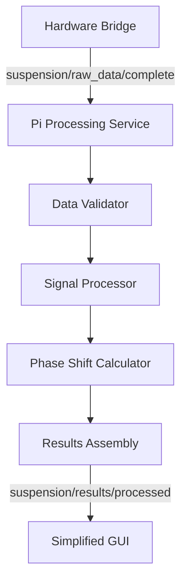

# Pi Processing Service

## Übersicht

Der Pi Processing Service ist der zentrale Datenverarbeitungsservice für den Fahrwerkstester, optimiert für Raspberry Pi
Hardware. Er führt Post-Processing der Messdaten durch und berechnet EGEA-konforme Phase-Shift-Werte.

## 🎯 Hauptfunktionen

- **Post-Processing**: Verarbeitung nach Testende (keine Echtzeit)
- **EGEA-konforme Phase-Shift-Berechnung**
- **Sinuskurven-Generierung** für GUI-Anzeige
- **Frequenzanalyse** und Signalverarbeitung
- **Robuste Datenvalidierung**
- **MQTT-Integration** für Service-Kommunikation

## 📁 Struktur

```
backend/pi_processing_service/
├── __init__.py                     # Package-Initialisierung
├── main.py                         # Haupt-Service-Logik
├── README.md                       # Diese Dokumentation
├── config/                         # Konfiguration
│   ├── __init__.py
│   └── pi_processing_config.yaml   # Service-Konfiguration
├── processing/                     # Datenverarbeitung
│   ├── __init__.py
│   ├── phase_shift_calculator.py   # EGEA Phase-Shift-Berechnung
│   └── data_validator.py           # Rohdaten-Validierung
└── utils/                          # Hilfsfunktionen
    ├── __init__.py
    └── signal_processing.py        # Signalverarbeitung & FFT
```

## 🚀 Installation & Start

### 1. Abhängigkeiten installieren

```bash
# Mit uv (empfohlen)
uv add numpy scipy paho-mqtt pyyaml python-can asyncio-mqtt

# Oder mit pip
pip install numpy scipy paho-mqtt pyyaml python-can asyncio-mqtt
```

### 2. Service starten

```bash
# Direkt
python backend/pi_processing_service/main.py

# Als Modul
python -m backend.pi_processing_service.main

# Mit spezifischer Konfiguration
python backend/pi_processing_service/main.py --config custom_config.yaml
```

### 3. Als systemd Service (Pi-Deployment)

```bash
# Service-Datei erstellen
sudo tee /etc/systemd/system/pi-processing.service << EOF
[Unit]
Description=Fahrwerkstester Pi Processing Service
After=network.target mosquitto.service

[Service]
Type=simple
User=pi
WorkingDirectory=/home/pi/fahrwerkstester
ExecStart=/usr/bin/uv run python backend/pi_processing_service/main.py
Restart=always

[Install]
WantedBy=multi-user.target
EOF

# Service aktivieren und starten
sudo systemctl enable pi-processing
sudo systemctl start pi-processing
```

## 📊 Datenfluss



## 🔧 Konfiguration

Die Konfiguration erfolgt über `config/pi_processing_config.yaml`:

```yaml
# MQTT-Verbindung
mqtt:
  broker: "localhost"
  port: 1883

# Processing-Parameter
processing:
  heartbeat_interval: 30.0
  phase_shift:
    min_calc_freq: 6.0    # Hz
    max_calc_freq: 18.0   # Hz
    phase_threshold: 35.0 # Grad

# Logging
logging:
  level: "INFO"
  log_file: "/var/log/fahrwerkstester/pi_processing.log"
```

## 📡 MQTT-Topics

### Input (Subscribed)

- `suspension/raw_data/complete` - Komplette Rohdaten vom Hardware Bridge
- `suspension/test/completed` - Test-Abschluss-Signale
- `suspension/processing/command` - Service-Commands

### Output (Published)

- `suspension/results/processed` - Fertige Testergebnisse mit Sinuskurven
- `suspension/system/processing` - Service-Status
- `suspension/system/heartbeat` - Heartbeat-Signale

## 🧪 API-Verwendung

### Programmatische Nutzung

```python
from backend.pi_processing_service import PiProcessingService

# Service erstellen
service = PiProcessingService(config_path="my_config.yaml")

# Service starten
await service.start()

# Service stoppen
await service.stop()
```

### Phase-Shift-Calculator direkt verwenden

```python
from backend.pi_processing_service.processing import PhaseShiftCalculator
import numpy as np

# Calculator erstellen
calculator = PhaseShiftCalculator()

# Phase-Shift berechnen
result = await calculator.calculate(
	platform_data=np.array([...]),
	force_data=np.array([...]),
	time_data=np.array([...]),
	static_weight=500.0
)

print(f"Minimale Phasenverschiebung: {result['min_phase_shift']}°")
```

## 📈 Performance-Optimierungen für Pi

### Memory-Optimierungen

- **Adaptive FFT-Größe**: Begrenzt auf 16384 Punkte
- **Streaming-Processing**: Keine großen Arrays im Memory
- **Garbage Collection**: Automatische Speicherbereinigung

### CPU-Optimierungen

- **Asynchrone Verarbeitung**: Non-blocking I/O
- **Batch-Processing**: Verarbeitung nach Testende
- **Adaptive Algorithmen**: Anpassung an verfügbare Ressourcen

### Pi-spezifische Features

- **Single-threaded Mode**: Optimiert für Pi-Hardware
- **Resource Monitoring**: Überwachung von CPU/Memory
- **Graceful Degradation**: Fallback bei Ressourcen-Knappheit

## 🐛 Debugging & Logging

### Log-Level setzen

```bash
# Debug-Modus
python backend/pi_processing_service/main.py --log-level DEBUG

# Logs anschauen
tail -f /var/log/fahrwerkstester/pi_processing.log
```

### Performance-Statistiken

```python
# Im Service verfügbar über MQTT
mosquitto_pub - h
localhost - t
"suspension/processing/command"
- m
'{"command": "status"}'
```

### Service-Status prüfen

```bash
# Systemd-Status
sudo systemctl status pi-processing

# MQTT-Heartbeat überwachen
mosquitto_sub -h localhost -t "suspension/system/heartbeat"
```

## 🔬 Testing

### Unit-Tests

```bash
# Spezifische Module testen
python -m pytest backend/pi_processing_service/processing/test_phase_shift_calculator.py

# Gesamtes Package testen  
python -m pytest backend/pi_processing_service/
```

### Integration-Tests

```bash
# Mit echten MQTT-Daten
python backend/pi_processing_service/test_integration.py

# Performance-Tests
python backend/pi_processing_service/test_performance.py
```

## 🚨 Troubleshooting

### Häufige Probleme

**Service startet nicht**

```bash
# Logs prüfen
journalctl -u pi-processing -f

# Dependencies prüfen
uv sync
```

**MQTT-Verbindung fehlgeschlagen**

```bash
# Broker testen
mosquitto_pub -h localhost -t test -m "hello"

# Netzwerk prüfen
ping localhost
```

**Memory-Probleme**

```bash
# Memory-Nutzung überwachen
htop

# Swap aktivieren
sudo dphys-swapfile start
```

**Performance-Probleme**

```bash
# CPU-Auslastung prüfen
top

# Service-Statistiken
curl http://localhost:8080/api/stats
```

## 📚 Weitere Dokumentation

- [Deployment-Guide](../../scripts/deploy_pi_service.sh)
- [EGEA-Spezifikation](../../docs/EGEA-Phase-Shift-Method.pdf)
- [Hardware-Integration](../../hardware/hardware_bridge.py)
- [API-Dokumentation](../../docs/API.md)

## 🔄 Updates & Wartung

### Service-Update

```bash
# Code aktualisieren
git pull origin main

# Dependencies aktualisieren
uv sync

# Service neu starten
sudo systemctl restart pi-processing
```

### Backup & Recovery

```bash
# Konfiguration sichern
cp config/pi_processing_config.yaml backup/

# Logs archivieren
sudo logrotate -f /etc/logrotate.d/fahrwerkstester
```

---