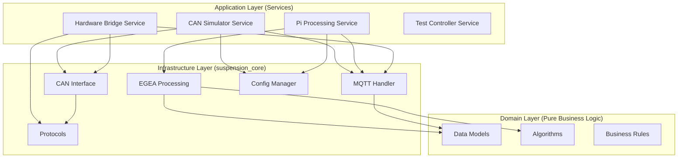

# Suspension Core Library

> **Zentrale Infrastrukturbibliothek für das Fahrwerkstester-System nach hexagonaler Architektur**

## 🎯 Überblick

Die `suspension_core` Bibliothek implementiert die **Infrastructure-Schicht** der hexagonalen Architektur und stellt
allen Services und Anwendungen gemeinsame Funktionalitäten zur Verfügung. Sie abstrahiert komplexe technische Details
und ermöglicht lose gekoppelte, testbare Komponenten.

### 🏗️ Architektur-Rolle



## 📦 Kernmodule

### 1. 🔬 **EGEA-Modul** (`egea/`)

**EGEA-konforme Phase-Shift-Implementierung nach SPECSUS2018**

```python
from suspension_core.egea.processors import PhaseShiftProcessor
from suspension_core.egea.models import TestResult, MeasurementData

# EGEA-Processor initialisieren
processor = PhaseShiftProcessor(
	min_frequency=6.0,
	max_frequency=25.0,
	phase_threshold=35.0
)

# Phasenverschiebung berechnen
result = processor.calculate_phase_shift(
	time_data=time_series,
	platform_position=platform_data,
	tire_force=force_data
)

print(f"Minimale Phasenverschiebung: {result.min_phase_shift:.1f}°")
print(f"Bewertung: {result.evaluation}")  # "excellent", "good", "acceptable", "poor"
```

**Submodule:**

- `models/`: Pydantic-Datenmodelle für EGEA-Ergebnisse und -Parameter
- `processors/`: Signalverarbeitungsalgorithmen (Phase-Shift, Filter, etc.)
- `config/`: EGEA-spezifische Konfigurationsparameter
- `tests/`: Umfassende Unit- und Integration-Tests

### 2. 📡 **MQTT-Modul** (`mqtt/`)

**Event-driven Kommunikation zwischen Services**

```python
from suspension_core.mqtt.handler import MqttHandler
from suspension_core.mqtt.client import MqttClient

# High-Level Handler für Service-Kommunikation
mqtt_handler = MqttHandler(
	broker="localhost",
	port=1883,
	client_id="processing_service",
	app_type="backend"
)


# Event-Handler registrieren
@mqtt_handler.on_message("suspension/test/start")
def handle_test_start(message):
	"""Behandelt Test-Start-Kommandos"""
	test_config = message['config']
	start_test_with_config(test_config)


# Service-spezifische Topics
mqtt_handler.publish_test_result({
	"test_id": "12345",
	"phase_shift": 42.3,
	"evaluation": "good",
	"timestamp": time.time()
})

# Low-Level Client für erweiterte Kontrolle
mqtt_client = MqttClient()
mqtt_client.connect_async("broker.example.com", 1883)
```

**Features:**

- **Auto-Reconnection**: Automatische Wiederverbindung bei Verbindungsabbruch
- **Message-Schemas**: Pydantic-validierte Nachrichten-Strukturen
- **Topic-Namespacing**: Standardisierte Topic-Hierarchie
- **Async/Sync Support**: Flexibler Client für verschiedene Use Cases

### 3. 🚌 **CAN-Modul** (`can/`)

**Hardware-abstrahierte CAN-Bus-Kommunikation**

```python
from suspension_core.can.interface_factory import create_can_interface
from suspension_core.can.protocols import EusamaProtocol

# Interface-Factory mit automatischer Hardware/Simulator-Erkennung
can_interface = create_can_interface(
	channel="can0",  # Linux: can0, Windows: COM3
	baudrate=1000000,  # 1 Mbit/s für EUSAMA
	auto_detect=True,  # Auto-Detection verfügbarer Interfaces
	simulation_mode=False  # False für Hardware, True für Simulation
)

# EUSAMA-Protokoll verwenden
eusama = EusamaProtocol(can_interface)

# Motor-Steuerung
eusama.send_motor_command(
	position="left",  # "left", "right"
	duration=8  # Sekunden
)


# Sensor-Daten empfangen mit Callback
@eusama.on_sensor_data
def handle_sensor_data(data):
	"""Verarbeitet eingehende DMS-Sensordaten"""
	print(f"Kraft: {data.force:.2f}N, Position: {data.position:.3f}mm")


# Simulation für Entwicklung/Tests
simulated_interface = create_can_interface(simulation_mode=True)
```

**Features:**

- **Cross-Platform**: Linux (SocketCAN), Windows (PCAN), macOS (virtuelle Interfaces)
- **Protocol Abstraction**: EUSAMA, ASA-Livestream-Protokolle
- **Simulation Support**: Realistische Daten-Simulation für Tests
- **Auto-Baudrate-Detection**: Automatische Erkennung der optimalen Baudrate

### 4. ⚙️ **Configuration-Modul** (`config/`)

**Zentrale, validierte Konfigurationsverwaltung**

```python
from suspension_core.config.config_model import settings
from suspension_core.config.manager import ConfigManager

# Pydantic-basierte Settings (Typ-sicher)
mqtt_broker = settings.mqtt.broker  # localhost
can_baudrate = settings.can.baudrate  # 1000000
egea_threshold = settings.egea.phase_threshold  # 35.0

# Dynamische Konfiguration mit ConfigManager
config = ConfigManager()

# Hierarchische Konfiguration (Punkt-Notation)
config.set("system.development_mode", True)
config.set("egea.frequency_range.min", 6.0)
config.set("egea.frequency_range.max", 25.0)

# Umgebungsvariablen-Integration
# SUSPENSION_MQTT_BROKER=production.broker.com
# SUSPENSION_CAN_INTERFACE=can1
broker = config.get("mqtt.broker")  # Automatisch von ENV überschrieben

# Validierung und Typ-Sicherheit
try:
	config.set("can.baudrate", "invalid")  # Wirft ValidationError
except ValidationError as e:
	print(f"Konfigurationsfehler: {e}")

# Persistierung
config.save_config("~/.suspension_tester/config.yaml")
```

**Features:**

- **Pydantic-Integration**: Typ-sichere Konfiguration mit automatischer Validierung
- **Hierarchische Struktur**: Übersichtliche Gruppierung verwandter Parameter
- **Environment Override**: Selektive Überschreibung durch Umgebungsvariablen
- **Multiple Formats**: YAML, JSON, TOML-Unterstützung
- **Hot-Reload**: Dynamische Neukonfiguration zur Laufzeit

### 5. 🔌 **Protocols-Modul** (`protocols/`)

**Standardisierte Nachrichten-Formate und Protokoll-Implementierungen**

```python
from suspension_core.protocols.messages import (
	TestStartCommand, TestResultMessage, SystemStatusMessage
)
from suspension_core.protocols.eusama import EusamaProtocol
from suspension_core.protocols.asa import AsaProtocol

# Nachrichten-Schemas (Pydantic-validiert)
test_command = TestStartCommand(
	test_id="12345",
	position="front_left",
	method="phase_shift",
	parameters={
		"frequency_range": [6.0, 25.0],
		"amplitude": 6.0,
		"duration": 30.0
	}
)

# JSON-Serialisierung mit Schema-Validierung
json_message = test_command.model_dump_json()
print(json_message)

# Protokoll-spezifische Implementierungen
eusama_protocol = EusamaProtocol()
eusama_message = eusama_protocol.encode_motor_command("left", 8)

asa_protocol = AsaProtocol()
asa_status = asa_protocol.decode_status_message(raw_can_data)
```

**Unterstützte Protokolle:**

- **EUSAMA**: 1 Mbit/s, Extended CAN-IDs, DMS-basiert
- **ASA-Livestream**: 125-250 kBit/s, Status-orientiert
- **Custom Protocols**: Erweiterbar für proprietäre Systeme

## 🚀 Installation & Setup

### 1. Development-Installation

```bash
# Repository klonen und navigieren
cd shock_tester/common/suspension_core/

# Mit uv (modern Python packaging)
uv venv
uv pip install -e .

# Alternative: pip
pip install -e .

# Dependencies installieren
uv pip install -r requirements.txt

# Für EGEA-Signalverarbeitung (zusätzliche Abhängigkeiten)
uv pip install -r requirements-egea.txt
```

### 2. Produktions-Installation

```bash
# Als Package installieren
pip install suspension-core==2.0.0

# Oder direkt von Git
pip install git+https://github.com/username/shock_tester.git#subdirectory=common/suspension_core
```

### 3. Konfiguration

```yaml
# ~/.suspension_tester/config.yaml
system:
  log_level: "INFO"
  development_mode: false

mqtt:
  broker: "localhost"
  port: 1883
  username: null
  password: null

can:
  interface: "can0"
  baudrate: 1000000
  protocol: "eusama"
  simulation_mode: false

egea:
  phase_threshold: 35.0
  frequency_range:
    min: 6.0
    max: 25.0
  signal_processing:
    filter_type: "kaiser_reed"
    window_size: 1024
```

## 📊 Dependency-Matrix

| Modul         | Core Dependencies       | Optional Dependencies                   |
|---------------|-------------------------|-----------------------------------------|
| **egea**      | `numpy`, `scipy`        | `matplotlib` (Plots), `pandas` (Export) |
| **mqtt**      | `paho-mqtt`, `pydantic` | `asyncio-mqtt` (Async)                  |
| **can**       | `python-can`            | `python-can[pcan]` (Windows)            |
| **config**    | `pydantic`, `pyyaml`    | `tomli` (TOML), `python-dotenv`         |
| **protocols** | `pydantic`              | `jsonschema` (Validation)               |

## 🧪 Testing & Qualitätssicherung

### Unit-Tests

```bash
# Alle Tests ausführen
python -m pytest

# Modul-spezifische Tests
python -m pytest egea/tests/
python -m pytest mqtt/tests/
python -m pytest can/tests/

# Coverage-Report
python -m pytest --cov=suspension_core --cov-report=html
```

### Integration-Tests

```bash
# MQTT-EGEA-Pipeline testen
python -m pytest tests/integration/test_mqtt_egea_integration.py

# CAN-Simulation testen
python -m pytest tests/integration/test_can_simulation.py

# End-to-End Test mit allen Komponenten
python tests/integration/test_full_stack.py
```

### Performance-Tests

```bash
# EGEA-Algorithmus-Performance
python tests/performance/benchmark_egea_processing.py

# MQTT-Durchsatz-Tests
python tests/performance/benchmark_mqtt_throughput.py
```

### Code-Qualität

```bash
# Type-Checking mit mypy
mypy suspension_core/

# Linting mit ruff
ruff check suspension_core/

# Formatierung mit black
black suspension_core/
```

## 🏗️ Architektur-Patterns

### Repository Pattern (Config-Management)

```python
# Abstrakte Repository-Schnittstelle
from abc import ABC, abstractmethod


class ConfigRepository(ABC):
	@abstractmethod
	def load_config(self, path: str) -> Dict[str, Any]: ...

	@abstractmethod
	def save_config(self, config: Dict[str, Any], path: str) -> None: ...


# Konkrete Implementierungen
class YamlConfigRepository(ConfigRepository): ...


class JsonConfigRepository(ConfigRepository): ...


class DatabaseConfigRepository(ConfigRepository): ...
```

### Observer Pattern (Event-Handling)

```python
# MQTT-Handler als Event-Bus
from suspension_core.mqtt.handler import MqttHandler

mqtt = MqttHandler()


# Observer registrieren
@mqtt.on_message("suspension/test/start")
def start_test_observer(message): ...


@mqtt.on_message("suspension/test/stop")
def stop_test_observer(message): ...


# Event auslösen
mqtt.publish("suspension/test/start", {"test_id": "123"})
```

### Strategy Pattern (Testmethoden)

```python
# Austauschbare EGEA-Algorithmen
from suspension_core.egea.processors import (
	PhaseShiftProcessor, ResonanceProcessor, HybridProcessor
)


class TestManager:
	def __init__(self, strategy: ProcessorStrategy):
		self.processor = strategy

	def run_test(self, data: MeasurementData) -> TestResult:
		return self.processor.process(data)


# Verschiedene Strategien zur Laufzeit wählen
egea_manager = TestManager(PhaseShiftProcessor())
resonance_manager = TestManager(ResonanceProcessor())
```

### Factory Pattern (Interface-Erstellung)

```python
# CAN-Interface-Factory
from suspension_core.can.interface_factory import create_can_interface

# Automatische Auswahl basierend auf Environment
interface = create_can_interface(
	platform="auto",  # auto, linux, windows, macos
	simulation_mode="auto",  # auto, hardware, simulation
	protocol="eusama"  # eusama, asa
)
```

## 📈 Performance-Optimierungen

### EGEA-Signalverarbeitung

- **Vectorized NumPy**: Optimierte Array-Operationen für große Datensätze
- **SciPy-Filter**: Hochperformante digitale Filter-Implementierungen
- **Memory-Mapping**: Effiziente Verarbeitung großer Messdateien
- **Parallel Processing**: Multi-Threading für mehrere Achsen gleichzeitig

### MQTT-Kommunikation

- **Connection Pooling**: Wiederverwendung von MQTT-Verbindungen
- **Message Batching**: Gruppierung kleiner Nachrichten für besseren Durchsatz
- **Compression**: Optional GZIP-Kompression für große Payloads
- **Async Support**: Non-blocking I/O für hochfrequente Updates

### CAN-Bus-Optimierung

- **Hardware-Buffering**: Verwendung von Hardware-Puffern wenn verfügbar
- **Interrupt-based Reception**: Minimale Latenz bei CAN-Message-Empfang
- **Baudrate-Caching**: Speicherung erkannter optimaler Baudraten

## 🔧 Erweiterte Konfiguration

### Logging-Setup

```python
import logging
from suspension_core.config.config_model import settings

# Globales Logging konfigurieren
logging.basicConfig(
	level=getattr(logging, settings.system.log_level),
	format='%(asctime)s - %(name)s - %(levelname)s - %(message)s',
	handlers=[
		logging.FileHandler('suspension_core.log'),
		logging.StreamHandler()
	]
)

# Modul-spezifische Logger
egea_logger = logging.getLogger('suspension_core.egea')
mqtt_logger = logging.getLogger('suspension_core.mqtt')
```

### Development vs. Production

```python
from suspension_core.config.config_model import settings

if settings.system.development_mode:
	# Development-spezifische Einstellungen
	can_interface = create_can_interface(simulation_mode=True)
	mqtt_broker = "localhost"
	log_level = "DEBUG"
else:
	# Production-Konfiguration
	can_interface = create_can_interface(simulation_mode=False)
	mqtt_broker = settings.mqtt.broker
	log_level = "INFO"
```

## 🤝 Contributing

### Code-Style Guidelines

```python
# Typ-Annotationen verwenden
def process_measurement(data: MeasurementData) -> TestResult:
	"""
    Verarbeitet Messdaten und gibt Testergebnis zurück.
    
    Args:
        data: Validierte Messdaten mit Zeitstempel und Sensorwerten
        
    Returns:
        Vollständiges Testergebnis mit Bewertung und Metadaten
        
    Raises:
        ValidationError: Bei ungültigen Eingabedaten
        ProcessingError: Bei Fehlern in der Signalverarbeitung
    """
	# Implementation...
```

### Testing-Guidelines

```python
# Umfassende Tests für jede Public-API
def test_phase_shift_calculation_with_known_data():
	"""Test mit bekannten Eingabe-/Ausgabedaten"""
	# Given
	processor = PhaseShiftProcessor()
	test_data = load_test_fixture("phase_shift_45_degrees.json")

	# When  
	result = processor.calculate_phase_shift(
		test_data.time,
		test_data.platform_position,
		test_data.tire_force
	)

	# Then
	assert 44.0 <= result.min_phase_shift <= 46.0
	assert result.evaluation == "good"


# Mock für externe Dependencies
@patch('suspension_core.mqtt.handler.MqttClient')
def test_mqtt_handler_publish(mock_client):
	"""Test MQTT-Handler isoliert von echtem Broker"""
	# Test implementation...
```

---

**Letztes Update**: Juni 2025  