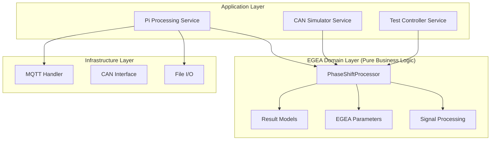

# EGEA Phase-Shift Processing Module

> **SPECSUS2018-konforme EGEA-Implementierung für hochpräzise Dämpfungsprüfung**

## 🎯 Überblick

Das EGEA-Modul implementiert die **Domain-Logic** für EGEA-konforme Phase-Shift-Analysemethoden nach **SPECSUS2018**. Es
stellt die Kern-Algorithmen für moderne Fahrwerkstester bereit und ersetzt traditionelle Resonanzmethoden durch präzise
Phasenverschiebungsanalyse zwischen Plattformbewegung und Reifenaufstandskraft.

### 🏗️ Domain-Driven Design



## 📦 Modul-Struktur

```
common/suspension_core/egea/
├── 🎯 processors/               # Kern-Algorithmen (Domain Logic)
│   ├── phase_shift_processor.py # EGEA-Hauptalgorithmus
│   └── __init__.py
│
├── 📊 models/                   # Datenmodelle (Domain Objects)
│   ├── results.py              # Pydantic-Results für EGEA-Daten
│   └── __init__.py
│
├── ⚙️ config/                   # Domain-Konfiguration  
│   ├── parameters.py           # EGEA-Parameter nach SPECSUS2018
│   └── __init__.py
│
├── 🔧 utils/                    # Domain-Utilities
│   ├── signal_processing.py    # EGEA-konforme Signalverarbeitung
│   └── __init__.py
│
├── 🧪 tests/                    # Umfassende Test-Suite
│   ├── test_processors.py      # Processor-Unit-Tests
│   ├── test_signal_processing.py # Signal-Processing-Tests
│   ├── test_parameters.py      # Parameter-Validierung
│   └── __init__.py
│
├── 📋 examples/                 # Code-Beispiele & Demos
│   ├── main_example.py         # Vollständiges Verwendungsbeispiel
│   └── __init__.py
│
└── __init__.py                  # Public API
```

## 🔬 Kernkomponenten

### 1. **EGEAPhaseShiftProcessor** - Haupt-Engine

**SPECSUS2018-konforme Phase-Shift-Berechnung mit vollständiger EGEA-Compliance**

```python
from suspension_core.egea.processors import EGEAPhaseShiftProcessor
from suspension_core.egea.models.results import VehicleType
import numpy as np

# Processor initialisieren
processor = EGEAPhaseShiftProcessor()

# Vollständigen EGEA-Test durchführen
result = processor.process_complete_test(
	platform_position=platform_data,  # Plattform-Position (mm)
	tire_force=force_data,  # Reifenkraft (N)
	time_array=time_data,  # Zeit (s)
	static_weight=650.0,  # Statisches Radgewicht (N)
	wheel_id="FL",  # Rad-ID (Front Left)
	vehicle_type=VehicleType.M1  # PKW
)

# Ergebnisse auswerten
print(f"🎯 Rad {result.wheel_id}:")
print(f"   φmin: {result.phase_shift_result.min_phase_shift:.1f}° "
      f"(iφmin: {result.phase_shift_result.integer_min_phase}°)")
print(f"   RFAmax: {result.force_analysis.rfa_max:.1f}%")
print(f"   Rigidity: {result.rigidity_result.rigidity:.1f} N/mm")
print(f"   ✅ PASS" if result.overall_pass else "❌ FAIL")

# Absolutes Kriterium: φmin ≥ 35°
if result.absolute_criterion_pass:
	print("   ✅ Absolute criterion: PASS (φmin ≥ 35°)")
else:
	print("   ❌ Absolute criterion: FAIL (φmin < 35°)")
```

### 2. **EGEA Result Models** - Typ-sichere Datenstrukturen

**Pydantic-basierte Datenmodelle für vollständige EGEA-Ergebnisse**

```python
from suspension_core.egea.models.results import (
	EGEATestResult, PhaseShiftResult, PhaseShiftPeriod,
	AxleTestResult, VehicleType
)

# Einzelnes Rad-Ergebnis
wheel_result: EGEATestResult = processor.process_complete_test(...)

# Achsen-Ergebnis (links + rechts)
axle_result = AxleTestResult(
	axle_id="Front",
	left_wheel=front_left_result,
	right_wheel=front_right_result
)

# Unbalanzen automatisch berechnen
axle_result.calculate_imbalances()

print(f"🔄 Achsen-Unbalanzen:")
print(f"   DRFAmax: {axle_result.d_rfa_max:.1f}% (Limit: 30%)")
print(f"   Dφmin: {axle_result.d_phi_min:.1f}% (Limit: 30%)")
print(f"   DRigidity: {axle_result.d_rigidity:.1f}% (Limit: 35%)")
print(f"   Achsgewicht: {axle_result.axle_weight:.0f}N")

# JSON-Export für API
result_json = wheel_result.summary
# {"wheel_id": "FL", "min_phase_shift": 42.3, "rfa_max": 18.5, ...}
```

### 3. **EGEA Parameters** - SPECSUS2018-Konfiguration

**Zentrale Parameter-Verwaltung nach EGEA-Standard**

```python
from suspension_core.egea.config.parameters import EGEAParameters

# Standard-Parameter laden
params = EGEAParameters()

# Kritische EGEA-Schwellenwerte
print(f"Phase Shift Minimum: {params.PHASE_SHIFT_MIN}°")  # 35°
print(f"Frequency Range: {params.MIN_CALC_FREQ}-{params.MAX_CALC_FREQ} Hz")  # 6-25 Hz
print(f"Platform Amplitude: {params.PLATFORM_AMPLITUDE} mm")  # 3.0 mm

# Rigidity-Parameter (3.20)
print(f"Rigidity Formula: rig = {params.A_RIG} * (H25/{params.PLATFORM_AMPLITUDE}) + {params.B_RIG}")
print(f"Rigidity Limits: {params.RIG_LO_LIM} - {params.RIG_HI_LIM} N/mm")

# Custom Parameter für spezielle Anwendungen
custom_params = EGEAParameters(
	phase_shift_min=40.0,  # Strengeres Kriterium
	platform_amplitude=6.0  # Größere Amplitude
)
```

### 4. **Signal Processing Utilities** - EGEA-konforme Filterung

**Spezialisierte Signalverarbeitung für EGEA-Standards**

```python
from suspension_core.egea.utils.signal_processing import EGEASignalProcessor
import numpy as np

processor = EGEASignalProcessor()

# EGEA-konforme Phase-Filter anwenden
filtered_signal = processor.apply_egea_phase_filter(
	signal=tire_force_data,
	sampling_rate=1000.0,  # Hz
	target_frequency=15.0  # Hz
)

# Platform-TOPs identifizieren (korrekte TOPp(i) Berechnung)
platform_peaks = processor.find_platform_tops(platform_position)
print(f"Gefundene Platform-TOPs: {len(platform_peaks)} Peaks")

# Fref-Berechnung (3.21) - Verbesserte Methode
fref = processor.calculate_fref(
	force_signal=filtered_signal,
	time_array=time_data,
	static_weight=650.0,
	period_start=0.0,
	period_end=1.0
)

# Signal Overflow/Underflow Detection (3.16)
f_under_flag, f_over_flag = processor.detect_signal_overflow_underflow(
	force_signal=tire_force_data,
	static_weight=650.0
)

if f_under_flag:
	print("⚠️ Signal Underflow detected")
if f_over_flag:
	print("⚠️ Signal Overflow detected")
```

## 🧮 EGEA-Algorithmus-Details

### Phase-Shift-Berechnung (3.21, 3.22)

$$\phi_i = (t_{Fref}(i) - t_{TOPp}(i)) \times f_i \times 2\pi \times \frac{180°}{\pi}$$

```python
# Erweiterte Phase-Shift-Berechnung mit Sub-Sample-Genauigkeit
def calculate_advanced_phase_shift(processor, platform_pos, tire_force, time_array, static_weight):
	"""Demonstriert erweiterte EGEA-Phase-Shift-Berechnung"""

	# 1. Signal-Preprocessing mit EGEA-konformen Filtern
	fs = 1.0 / (time_array[1] - time_array[0])

	# 2. Platform-TOP-Detection mit verbesserter Genauigkeit
	platform_peaks = processor.signal_processor.find_platform_tops(platform_pos)

	# 3. Periode-für-Periode-Analyse
	results = []
	for i in range(1, len(platform_peaks)):
		period_start = int(platform_peaks[i - 1])
		period_end = int(platform_peaks[i])

		# Frequenz für diese Periode
		frequency = processor.signal_processor.calculate_cycle_frequency(
			period_start, period_end, time_array
		)

		# Nur EGEA-relevante Frequenzen (6-25 Hz)
		if not (6.0 <= frequency <= 25.0):
			continue

		# Periode-Daten extrahieren
		cycle_force = tire_force[period_start:period_end]
		cycle_time = time_array[period_start:period_end]
		cycle_platform = platform_pos[period_start:period_end]

		# EGEA-konforme Filter anwenden
		filtered_force = processor.signal_processor.apply_egea_phase_filter(
			cycle_force, fs, frequency
		)

		# Echte TOPp(i) Position (nicht nur Zyklusstart!)
		platform_peak_idx = np.argmax(cycle_platform)
		top_p_time = cycle_time[platform_peak_idx] - cycle_time[0]

		# Fref-Berechnung (verbesserter Algorithmus)
		fref = processor.signal_processor.calculate_fref(
			filtered_force, cycle_time, static_weight,
			cycle_time[0], cycle_time[-1]
		)

		if fref is not None:
			fref_relative = fref - cycle_time[0]

			# Phasenverschiebung berechnen
			phase_shift_rad = (fref_relative - top_p_time) * frequency * 2 * np.pi
			phase_shift_deg = np.degrees(phase_shift_rad)

			# Normalisierung auf 0°-180°
			phase_shift_deg = phase_shift_deg % 360
			if phase_shift_deg > 180:
				phase_shift_deg = 360 - phase_shift_deg

			results.append({
				'frequency': frequency,
				'phase_shift': phase_shift_deg,
				'fref_relative': fref_relative,
				'top_p_time': top_p_time
			})

	return results
```

### Relative Force Amplitude (RFAmax) - 3.18

$$RFA_{max} = \frac{FA_{max}}{F_{st}} \times 100\%$$

```python
def calculate_rfa_max(processor, tire_force, static_weight):
	"""RFAmax-Berechnung nach EGEA-Standard"""

	# Signal Overflow/Underflow Detection (3.16)
	f_under_flag, f_over_flag = processor.signal_processor.detect_signal_overflow_underflow(
		tire_force, static_weight
	)

	fmin = np.min(tire_force)
	fmax = np.max(tire_force)

	# FAmax-Berechnung basierend auf Overflow-Flags (3.17)
	if not f_under_flag and not f_over_flag:
		fa_max = static_weight - fmin  # Normale Bedingung
	elif f_under_flag and not f_over_flag:
		fa_max = fmax - static_weight  # Unterflow-Fall
	else:
		# Kritischer Fall - beide Flags
		fa_max = max(fmax - static_weight, static_weight - fmin)

	# RFAmax berechnen
	rfa_max = (fa_max / static_weight) * 100.0 if static_weight > 0 else 0.0

	return rfa_max, fa_max, f_under_flag, f_over_flag
```

### Rigidity-Berechnung (3.20)

$$rig = a_{rig} \times \frac{H_{25}}{e_p} + b_{rig}$$

```python
def calculate_egea_rigidity(processor, h25_amplitude, platform_amplitude=3.0):
	"""EGEA-konforme Reifensteifigkeitsberechnung"""

	params = processor.params

	# EGEA-Standard-Formel
	rigidity = (params.A_RIG * (h25_amplitude / platform_amplitude) + params.B_RIG)

	# Reifendruck-Warnungen
	warning_underinflation = rigidity < params.RIG_LO_LIM  # < 160 N/mm
	warning_overinflation = rigidity > params.RIG_HI_LIM  # > 400 N/mm

	result = {
		'rigidity': rigidity,
		'h25': h25_amplitude,
		'platform_amplitude': platform_amplitude,
		'pressure_ok': not (warning_underinflation or warning_overinflation),
		'warnings': {
			'underinflation': warning_underinflation,
			'overinflation': warning_overinflation
		}
	}

	return result
```

## 🧪 Testing & Validierung

### Unit-Tests mit bekannten Daten

```python
# tests/test_processors.py
import pytest
import numpy as np
from suspension_core.egea.processors import EGEAPhaseShiftProcessor


class TestEGEAProcessing:
	"""EGEA-Processor Unit-Tests mit bekannten Ein-/Ausgaben"""

	def test_good_damping_phase_shift(self):
		"""Test: Gute Dämpfung erzeugt φmin ≥ 35°"""
		# Given: Simulierte Daten mit bekannter Phasenverschiebung von 42°
		processor = EGEAPhaseShiftProcessor()

		time_data = np.linspace(0, 2.0, 2000)  # 2s @ 1000Hz
		frequency = 15.0  # Hz

		# Plattform-Signal: Sinusförmig
		platform_position = 3.0 * np.sin(2 * np.pi * frequency * time_data)

		# Reifenkraft: 42° Phasenverschiebung + Dämpfung
		phase_shift_rad = np.radians(42.0)
		tire_force = 650.0 + 120.0 * np.sin(2 * np.pi * frequency * time_data + phase_shift_rad)

		# When: EGEA-Analyse durchführen
		result = processor.process_complete_test(
			platform_position=platform_position,
			tire_force=tire_force,
			time_array=time_data,
			static_weight=650.0,
			wheel_id="TEST"
		)

		# Then: Erwartete Ergebnisse
		assert result.phase_shift_result.min_phase_shift is not None
		assert 40.0 <= result.phase_shift_result.min_phase_shift <= 44.0  # ±2° Toleranz
		assert result.absolute_criterion_pass  # φmin ≥ 35°
		assert result.phase_shift_result.integer_min_phase == 42

	def test_poor_damping_detection(self):
		"""Test: Schlechte Dämpfung wird korrekt erkannt"""
		# Given: Daten mit φmin = 25° (schlecht)
		processor = EGEAPhaseShiftProcessor()

		time_data = np.linspace(0, 2.0, 2000)
		frequency = 15.0

		platform_position = 3.0 * np.sin(2 * np.pi * frequency * time_data)

		# Nur 25° Phasenverschiebung = schlechte Dämpfung
		phase_shift_rad = np.radians(25.0)
		tire_force = 650.0 + 180.0 * np.sin(2 * np.pi * frequency * time_data + phase_shift_rad)

		# When
		result = processor.process_complete_test(
			platform_position=platform_position,
			tire_force=tire_force,
			time_array=time_data,
			static_weight=650.0,
			wheel_id="TEST"
		)

		# Then: Schlechte Dämpfung erkannt
		assert result.phase_shift_result.min_phase_shift is not None
		assert result.phase_shift_result.min_phase_shift < 35.0
		assert not result.absolute_criterion_pass  # φmin < 35°
		assert not result.overall_pass

	def test_axle_imbalance_calculation(self):
		"""Test: Achsen-Unbalanzen-Berechnung"""
		# Given: Zwei unterschiedliche Rad-Ergebnisse
		from suspension_core.egea.models.results import AxleTestResult, EGEATestResult

		# Simulierte Ergebnisse
		left_result = self._create_mock_result("FL", min_phase=45.0, rfa_max=15.0, rigidity=200.0)
		right_result = self._create_mock_result("FR", min_phase=35.0, rfa_max=25.0, rigidity=180.0)

		axle_result = AxleTestResult(
			axle_id="Front",
			left_wheel=left_result,
			right_wheel=right_result
		)

		# When: Unbalanzen berechnen
		axle_result.calculate_imbalances()

		# Then: Erwartete Unbalanzen
		# DRFAmax = |15-25|/max(15,25)*100 = 40%
		assert abs(axle_result.d_rfa_max - 40.0) < 0.1

		# Dφmin = |45-35|/max(45,35)*100 = 22.2%
		assert abs(axle_result.d_phi_min - 22.2) < 0.1

		# DRigidity = |200-180|/max(200,180)*100 = 10%
		assert abs(axle_result.d_rigidity - 10.0) < 0.1

	def _create_mock_result(self, wheel_id: str, min_phase: float, rfa_max: float, rigidity: float):
		"""Hilfsmethode: Mock-Result erstellen"""
		# Implementierung für Mock-EGEATestResult...
		pass
```

## 🚀 Verwendung in Services

### Pi Processing Service Integration

```python
# backend/pi_processing_service/processing/egea_processor.py
from suspension_core.egea.processors import EGEAPhaseShiftProcessor
from suspension_core.egea.models.results import EGEATestResult, VehicleType


class PiEGEAProcessor:
	"""EGEA-Integration für Pi Processing Service"""

	def __init__(self):
		self.processor = EGEAPhaseShiftProcessor()

	async def process_measurement_data(self, mqtt_data: dict) -> EGEATestResult:
		"""Verarbeitet MQTT-Messdaten mit EGEA-Algorithmus"""

		# Daten aus MQTT-Message extrahieren
		platform_position = np.array(mqtt_data['platform_position'])
		tire_force = np.array(mqtt_data['tire_force'])
		time_array = np.array(mqtt_data['time'])
		static_weight = mqtt_data['static_weight']
		wheel_id = mqtt_data['position']

		# EGEA-Verarbeitung
		result = self.processor.process_complete_test(
			platform_position=platform_position,
			tire_force=tire_force,
			time_array=time_array,
			static_weight=static_weight,
			wheel_id=wheel_id,
			vehicle_type=VehicleType.M1
		)

		return result

	def format_for_mqtt(self, result: EGEATestResult) -> dict:
		"""Formatiert EGEA-Result für MQTT-Versendung"""
		return {
			"event": "egea_result",
			"wheel_id": result.wheel_id,
			"min_phase_shift": result.phase_shift_result.min_phase_shift,
			"integer_min_phase": result.phase_shift_result.integer_min_phase,
			"rfa_max": result.force_analysis.rfa_max,
			"rigidity": result.rigidity_result.rigidity,
			"absolute_pass": result.absolute_criterion_pass,
			"overall_pass": result.overall_pass,
			"static_weight": result.phase_shift_result.static_weight,
			"timestamp": time.time()
		}
```

### CAN Simulator Integration

```python
# backend/can_simulator_service/core/egea_simulator.py
from suspension_core.egea.processors import EGEAPhaseShiftProcessor


class EGEADataSimulator:
	"""Simuliert realistische EGEA-Daten für Testing"""

	def __init__(self):
		self.processor = EGEAPhaseShiftProcessor()

	def generate_realistic_test_data(self, damping_quality: str, duration: float = 30.0):
		"""Generiert realistische Test-Daten basierend auf EGEA-Parametern"""

		# Qualitäts-spezifische Parameter
		quality_params = {
			"excellent": {"base_phase": 50.0, "noise_level": 0.02},
			"good": {"base_phase": 42.0, "noise_level": 0.05},
			"acceptable": {"base_phase": 36.0, "noise_level": 0.08},
			"poor": {"base_phase": 25.0, "noise_level": 0.12}
		}

		params = quality_params.get(damping_quality, quality_params["good"])

		# Zeit-Array (1000 Hz Sampling)
		time_array = np.linspace(0, duration, int(duration * 1000))

		# Frequenz-Sweep von 25 Hz → 6 Hz
		freq_start, freq_end = 25.0, 6.0
		frequencies = freq_start - (freq_start - freq_end) * (time_array / duration)

		# Platform-Position generieren
		platform_position = 3.0 * np.sin(2 * np.pi * np.cumsum(frequencies) * (time_array[1] - time_array[0]))

		# Realistische Reifenkraft mit variabler Phasenverschiebung
		tire_force = []
		static_weight = 650.0

		for i, (t, freq) in enumerate(zip(time_array, frequencies)):
			# Frequenz-abhängige Phasenverschiebung
			phase_deg = params["base_phase"] * (1.0 + 0.1 * np.sin(2 * np.pi * freq * 0.1))
			phase_rad = np.radians(phase_deg)

			# Kraft-Signal mit Rauschen
			force_amplitude = 120.0 * (1.0 + params["noise_level"] * np.random.normal())
			force = static_weight + force_amplitude * np.sin(2 * np.pi * freq * t + phase_rad)

			# Realistische Störungen hinzufügen
			noise = params["noise_level"] * static_weight * np.random.normal()
			tire_force.append(force + noise)

		return {
			'time': time_array,
			'platform_position': np.array(platform_position),
			'tire_force': np.array(tire_force),
			'frequencies': frequencies,
			'static_weight': static_weight,
			'expected_phase': params["base_phase"]
		}
```

## 📈 Performance-Optimierungen

### Vectorized NumPy-Operationen

```python
# Optimierte Batch-Verarbeitung für mehrere Perioden
def process_multiple_periods_vectorized(processor, periods_data):
	"""Vectorized Processing für bessere Performance"""

	# Alle Perioden gleichzeitig verarbeiten
	all_frequencies = np.array([p['frequency'] for p in periods_data])
	all_phase_shifts = np.array([p['phase_shift'] for p in periods_data])

	# Bulk-Validierung
	valid_mask = (all_frequencies >= 6.0) & (all_frequencies <= 25.0)

	# Vectorized Berechnungen
	min_phase_indices = np.argmin(all_phase_shifts[valid_mask])
	min_phase_shift = all_phase_shifts[valid_mask][min_phase_indices]

	return {
		'min_phase_shift': min_phase_shift,
		'valid_periods': np.sum(valid_mask),
		'processed_in_batch': True
	}
```

### Memory-Efficient Processing

```python
# Streaming-Processing für große Datensätze
def process_large_dataset_streaming(processor, data_generator, chunk_size=1000):
	"""Memory-effiziente Verarbeitung großer Datensätze"""

	results = []

	for chunk in data_generator(chunk_size):
		# Chunk-weise Verarbeitung
		chunk_result = processor.calculate_phase_shift_advanced(
			platform_position=chunk['platform'],
			tire_force=chunk['force'],
			time_array=chunk['time'],
			static_weight=chunk['static_weight']
		)

		# Nur kritische Ergebnisse behalten
		if chunk_result.min_phase_shift is not None:
			results.append({
				'min_phase': chunk_result.min_phase_shift,
				'frequency': chunk_result.min_phase_frequency,
				'timestamp': chunk['time'][0]
			})

		# Memory-Cleanup
		del chunk_result

	return results
```

## 🔧 Erweiterte Konfiguration

### Custom EGEA-Parameter

```python
# Angepasste Parameter für spezielle Anwendungen
from suspension_core.egea.config.parameters import EGEAParameters


class CustomEGEAParameters(EGEAParameters):
	"""Erweiterte EGEA-Parameter für LKW-Tests"""

	def __init__(self):
		super().__init__()

		# LKW-spezifische Anpassungen
		self.PHASE_SHIFT_MIN = 30.0  # Weniger streng für LKW
		self.RIG_LO_LIM = 200.0  # Höhere Steifigkeit
		self.RIG_HI_LIM = 800.0  # Breiterer Bereich
		self.PLATFORM_AMPLITUDE = 6.0  # Größere Amplitude

		# Erweiterte Frequenz-Range
		self.MIN_CALC_FREQ = 4.0  # Niedrigere Startfrequenz
		self.MAX_CALC_FREQ = 30.0  # Höhere Endfrequenz


# Verwendung mit Custom-Parametern
processor = EGEAPhaseShiftProcessor()
processor.params = CustomEGEAParameters()
```

## 📊 Export & Reporting

### EGEA-Bericht-Generation

```python
def generate_egea_report(wheel_results: List[EGEATestResult],
                         axle_results: List[AxleTestResult]) -> dict:
	"""Generiert vollständigen EGEA-Bericht"""

	report = {
		"test_summary": {
			"total_wheels": len(wheel_results),
			"passed_wheels": sum(1 for r in wheel_results if r.overall_pass),
			"failed_wheels": sum(1 for r in wheel_results if not r.overall_pass),
			"test_timestamp": time.strftime("%Y-%m-%d %H:%M:%S")
		},
		"wheel_results": [],
		"axle_results": [],
		"overall_vehicle_pass": all(r.overall_pass for r in axle_results)
	}

	# Rad-Details
	for result in wheel_results:
		report["wheel_results"].append({
			"wheel_id": result.wheel_id,
			"min_phase_shift": result.phase_shift_result.min_phase_shift,
			"integer_min_phase": result.phase_shift_result.integer_min_phase,
			"rfa_max": result.force_analysis.rfa_max,
			"rigidity": result.rigidity_result.rigidity,
			"static_weight": result.phase_shift_result.static_weight,
			"absolute_criterion": "PASS" if result.absolute_criterion_pass else "FAIL",
			"overall_result": "PASS" if result.overall_pass else "FAIL"
		})

	# Achsen-Details mit Unbalanzen
	for axle in axle_results:
		report["axle_results"].append({
			"axle_id": axle.axle_id,
			"axle_weight": axle.axle_weight,
			"imbalances": {
				"d_rfa_max": axle.d_rfa_max,
				"d_phi_min": axle.d_phi_min,
				"d_rigidity": axle.d_rigidity
			},
			"relative_criteria": {
				"rfa_max_pass": axle.relative_rfa_max_pass,
				"phi_min_pass": axle.relative_phi_min_pass,
				"rigidity_pass": axle.relative_rigidity_pass
			},
			"overall_pass": axle.overall_pass
		})

	return report
```

---


**SPECSUS2018-Konformität**: Vollständig implementiert  
**Letzte Aktualisierung**: Juni 2025  