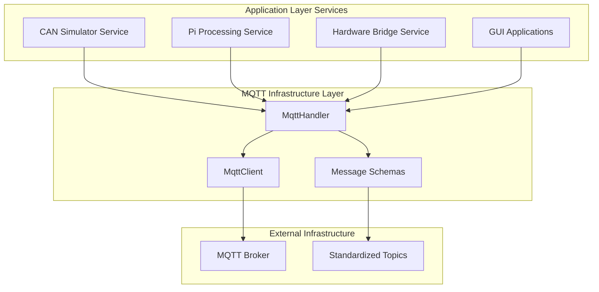

# MQTT Communication Module

> **Event-driven Service-Kommunikation für das Fahrwerkstester-System nach hexagonaler Architektur**

## 🎯 Überblick

Das MQTT-Modul implementiert die **Infrastructure-Schicht** für Event-driven Communication zwischen allen Services des Fahrwerkstester-Systems. Es abstrahiert MQTT-Komplexität und bietet typisierte, service-orientierte Kommunikation mit automatischem Reconnect, Message-Schemas und Performance-Optimierungen.

### 🏗️ Architektur-Rolle



## 📦 Modul-Struktur

```
common/suspension_core/mqtt/
├── 🎯 handler.py           # High-Level Service-Integration
├── 🔧 client.py            # Low-Level MQTT-Client
├── 📊 schemas.py           # Message-Schema-Validierung (optional)
├── 🔄 reconnect.py         # Auto-Reconnection-Logic (optional)
└── __init__.py             # Public API
```

## 🌟 Kernkomponenten

### 1. **MqttHandler** - High-Level Service-Integration

**App-spezifische MQTT-Abstraktion mit vordefinierter Fahrwerkstester-Topic-Struktur**

```python
from suspension_core.mqtt.handler import MqttHandler
import time

# Service-spezifische Handler erstellen
mqtt_handler = MqttHandler(
    client_id="pi_processing_service",
    host="localhost",
    port=1883,
    app_type="backend",           # "gui", "simulator", "tester", "backend"
    username="admin",             # Optional
    password="secret"             # Optional
)

# Verbindung herstellen (automatisches Topic-Subscription)
if mqtt_handler.connect(timeout=10.0):
    print("✅ MQTT connected and subscribed to relevant topics")
else:
    print("❌ MQTT connection failed")

# Event-Handler für verschiedene Message-Kategorien
@mqtt_handler.add_callback("test_results")
def handle_test_results(message):
    """Behandelt eingehende Testergebnisse"""
    print(f"📊 Test Result: {message['wheel_id']} - {message['overall_pass']}")

@mqtt_handler.add_callback("commands") 
def handle_commands(message):
    """Behandelt Service-Kommandos"""
    if message['command'] == 'start':
        print(f"🚀 Starting test: {message['position']}")
        start_test_processing(message)
```

### 2. **Standardisierte Topic-Hierarchie** - Event-Schema

**Vordefinierte Topics für lose gekoppelte Service-Kommunikation**

```python
# Standard-Topics (automatisch in MqttHandler verfügbar)
SUSPENSION_TOPICS = {
    # ==================== CORE COMMUNICATION ====================
    
    # System-Status (alle Services)
    "suspension/system/status":       # Service-Status-Updates  
    "suspension/system/heartbeat":    # Health-Monitoring
    
    # Test-Steuerung
    "suspension/test/start":          # Test-Start-Kommandos
    "suspension/test/stop":           # Test-Stop-Kommandos  
    "suspension/test/status":         # Test-Progress-Updates
    
    # Datenfluss
    "suspension/raw_data/complete":   # Vollständige Rohdaten (Hardware → Processing)
    "suspension/results/processed":   # Verarbeitete Ergebnisse (Processing → GUI)
    "suspension/measurements/live":   # Live-Messdaten-Stream
    
    # ==================== SERVICE-SPECIFIC ====================
    
    # CAN Simulator Service
    "suspension/simulator/command":   # Simulator-Steuerung
    "suspension/simulator/status":    # Simulator-Status
    "suspension/simulator/data":      # Generierte Simulation-Daten
    
    # Pi Processing Service  
    "suspension/processing/command":  # Processing-Befehle
    "suspension/processing/status":   # Processing-Status
    "suspension/processing/result":   # EGEA-Verarbeitungsergebnisse
    
    # Hardware Bridge Service
    "suspension/hardware/command":    # Hardware-Steuerung
    "suspension/hardware/status":     # Hardware-Status
    "suspension/hardware/sensor":     # Sensor-Rohdaten
    
    # GUI Applications
    "suspension/gui/command":         # GUI-Befehle an Backend
    "suspension/gui/update":          # GUI-Status-Updates
}

# Verwendung der Standard-Topics
mqtt_handler.publish("suspension/test/start", {
    "command": "start",
    "test_id": "test_12345",
    "position": "front_left",
    "method": "phase_shift",
    "parameters": {
        "duration": 30.0,
        "frequency_range": [6.0, 25.0]
    }
})
```

### 3. **Typisierte Message-Formate** - Schema-Validierung

**Pydantic-basierte Message-Schemas für type-safe Kommunikation**

```python
from suspension_core.mqtt.handler import MqttHandler
from pydantic import BaseModel, Field
from typing import Optional, List, Dict, Any
from enum import Enum

# Message-Schema-Definitionen
class TestCommand(BaseModel):
    """Schema für Test-Start-Kommandos"""
    command: str = Field(..., description="Kommando-Typ")
    test_id: str = Field(..., description="Eindeutige Test-ID")
    position: str = Field(..., description="Rad-Position (front_left, front_right, ...)")
    method: str = Field(default="phase_shift", description="Test-Methode")
    parameters: Optional[Dict[str, Any]] = Field(default_factory=dict)
    timestamp: Optional[float] = Field(default_factory=time.time)

class TestResult(BaseModel):
    """Schema für Test-Ergebnisse"""
    event: str = Field(default="test_result")
    test_id: str
    wheel_id: str
    min_phase_shift: Optional[float] = None
    rfa_max: Optional[float] = None  
    rigidity: Optional[float] = None
    overall_pass: bool = False
    timestamp: float = Field(default_factory=time.time)

class SystemStatus(BaseModel):
    """Schema für System-Status-Updates"""
    service_name: str
    status: str = Field(..., description="running, stopped, error")
    uptime: float = 0.0
    memory_usage: Optional[float] = None
    cpu_usage: Optional[float] = None
    last_activity: Optional[str] = None
    timestamp: float = Field(default_factory=time.time)

# Typisierte Handler-Methoden
def send_test_command_typed(mqtt_handler: MqttHandler, command: TestCommand):
    """Type-safe Test-Kommando senden"""
    message_dict = command.model_dump()
    return mqtt_handler.publish("suspension/test/start", message_dict)

def send_test_result_typed(mqtt_handler: MqttHandler, result: TestResult):
    """Type-safe Test-Ergebnis senden"""
    message_dict = result.model_dump()
    return mqtt_handler.publish("suspension/results/processed", message_dict)

def send_status_update_typed(mqtt_handler: MqttHandler, status: SystemStatus):
    """Type-safe Status-Update senden"""
    message_dict = status.model_dump()
    return mqtt_handler.publish("suspension/system/status", message_dict)

# Validierung beim Empfang
@mqtt_handler.add_callback("commands")
def handle_validated_command(raw_message: dict):
    """Validiert eingehende Kommandos gegen Schema"""
    try:
        command = TestCommand.parse_obj(raw_message)
        print(f"✅ Valid command: {command.command} for {command.position}")
        execute_test_command(command)
    except ValidationError as e:
        print(f"❌ Invalid command format: {e}")
```

### 4. **Observer Pattern** - Event-Driven Architecture

**Callback-basierte Event-Behandlung für lose gekoppelte Services**

```python
# Event-Observer-Setup für komplexe Service-Interaktionen
class SuspensionTestOrchestrator:
    """Service-übergreifende Test-Orchestrierung via MQTT-Events"""
    
    def __init__(self):
        self.mqtt = MqttHandler(
            client_id="test_orchestrator",
            app_type="backend"
        )
        
        # Event-Handler registrieren
        self.mqtt.add_callback("commands", self.handle_test_commands)
        self.mqtt.add_callback("status", self.handle_service_status)
        self.mqtt.add_callback("measurements", self.handle_live_data)
        self.mqtt.add_callback("test_results", self.handle_test_completion)
        
        self.active_tests = {}
        self.service_health = {}
        
    def handle_test_commands(self, message):
        """Orchestriert Test-Start über alle Services"""
        if message['command'] == 'start':
            test_id = message['test_id']
            position = message['position']
            
            print(f"🎬 Orchestrating test {test_id} for {position}")
            
            # 1. Hardware Bridge vorbereiten
            self.mqtt.publish("suspension/hardware/command", {
                "command": "prepare_test",
                "test_id": test_id,
                "position": position
            })
            
            # 2. Processing Service benachrichtigen
            self.mqtt.publish("suspension/processing/command", {
                "command": "start_processing",
                "test_id": test_id,
                "position": position
            })
            
            # 3. Test im Tracking speichern
            self.active_tests[test_id] = {
                "position": position,
                "start_time": time.time(),
                "status": "starting"
            }
            
    def handle_service_status(self, message):
        """Überwacht Service-Health"""
        service = message.get('source', 'unknown')
        status = message.get('state', 'unknown')
        
        self.service_health[service] = {
            "status": status,
            "last_seen": time.time()
        }
        
        print(f"📊 Service {service}: {status}")
        
        # Automatische Error-Recovery
        if status == "error":
            self.handle_service_error(service, message)
            
    def handle_live_data(self, message):
        """Verarbeitet Live-Messdaten"""
        test_id = message.get('test_id')
        if test_id in self.active_tests:
            # Live-Updates an GUI weiterleiten
            self.mqtt.publish("suspension/gui/update", {
                "event": "live_data",
                "test_id": test_id,
                "position": message.get('position'),
                "phase_shift": message.get('phase_shift'),
                "frequency": message.get('frequency'),
                "progress": self.calculate_test_progress(test_id)
            })
            
    def handle_test_completion(self, message):
        """Verarbeitet Test-Abschluss"""
        test_id = message.get('test_id')
        if test_id in self.active_tests:
            print(f"✅ Test {test_id} completed")
            
            # Test-Abschluss an alle Services kommunizieren
            self.mqtt.publish("suspension/test/completed", {
                "test_id": test_id,
                "result": message.get('overall_pass'),
                "timestamp": time.time()
            })
            
            # Cleanup
            del self.active_tests[test_id]
            
    def handle_service_error(self, service: str, error_message: dict):
        """Automatische Fehlerbehandlung"""
        print(f"🚨 Service error in {service}: {error_message.get('error', 'Unknown')}")
        
        # Service-Restart versuchen
        self.mqtt.publish(f"suspension/{service}/command", {
            "command": "restart",
            "reason": "error_recovery"
        })
```

### 5. **MqttClient** - Low-Level-Abstraktion

**Thread-sichere, robuste MQTT-Client-Implementierung**

```python
from suspension_core.mqtt.client import MqttClient
import threading
import time

# Low-Level Client für erweiterte Kontrolle
client = MqttClient(
    broker="production-broker.local",
    port=8883,                    # TLS-Port
    client_id="hardware_bridge",
    username="bridge_user",
    password="secure_password",
    use_tls=True,                 # TLS-Verschlüsselung
    ca_cert_path="/path/to/ca.crt"
)

# Erweiterte Verbindungsoptionen
connection_options = {
    "keepalive": 60,
    "clean_session": True,
    "reconnect_delay": [1, 2, 4, 8, 16],  # Exponential backoff
    "max_reconnect_attempts": 10
}

if client.connect_with_options(connection_options):
    print("🔒 Secure MQTT connection established")

# Batch-Publishing für Performance
messages = [
    ("suspension/sensor/force", {"sensor": "force_1", "value": 650.5}),
    ("suspension/sensor/position", {"sensor": "pos_1", "value": 2.3}),
    ("suspension/sensor/force", {"sensor": "force_2", "value": 648.2}),
]

# Batch senden (höhere Performance)
success_count = client.publish_batch(messages, qos=1)
print(f"📦 Sent {success_count}/{len(messages)} messages")

# Asynchrone Nachrichten mit Callbacks
def sensor_callback(topic: str, payload: dict):
    """Behandelt Sensor-Nachrichten asynchron"""
    sensor_id = payload.get('sensor')
    value = payload.get('value')
    print(f"📊 {sensor_id}: {value}")

client.subscribe_async("suspension/sensor/+", sensor_callback, qos=2)

# Connection-Health-Monitoring
def connection_monitor():
    """Überwacht Verbindungsqualität"""
    while True:
        stats = client.get_stats()
        print(f"📈 MQTT Stats: {stats['messages_sent']} sent, "
              f"{stats['messages_received']} received, "
              f"latency: {stats['avg_latency_ms']:.1f}ms")
        time.sleep(30)

threading.Thread(target=connection_monitor, daemon=True).start()
```

## 🔧 Service-Integration-Patterns

### Backend Service Template

```python
# Template für Backend-Service MQTT-Integration
from suspension_core.mqtt.handler import MqttHandler
from abc import ABC, abstractmethod
import asyncio
import logging

class BaseBackendService(ABC):
    """Basis-Template für Backend-Services mit MQTT-Integration"""
    
    def __init__(self, service_name: str, config: dict):
        self.service_name = service_name
        self.config = config
        self.logger = logging.getLogger(service_name)
        
        # MQTT-Handler initialisieren
        self.mqtt = MqttHandler(
            client_id=f"{service_name}_{int(time.time())}",
            host=config.get('mqtt_broker', 'localhost'),
            port=config.get('mqtt_port', 1883),
            app_type="backend",
            username=config.get('mqtt_username'),
            password=config.get('mqtt_password')
        )
        
        # Service-spezifische Callbacks
        self.mqtt.add_callback("commands", self.handle_commands)
        self.mqtt.add_callback("system", self.handle_system_messages)
        
        self.running = False
        self.last_heartbeat = 0
        
    async def start(self):
        """Service starten"""
        self.logger.info(f"Starting {self.service_name}")
        
        # MQTT-Verbindung herstellen
        if not self.mqtt.connect():
            raise ConnectionError("Failed to connect to MQTT broker")
            
        # Service als online melden
        await self.send_status_update("online", "Service started")
        
        self.running = True
        
        # Hauptloop starten
        await asyncio.gather(
            self.main_loop(),
            self.heartbeat_loop()
        )
        
    async def stop(self):
        """Service stoppen"""
        self.logger.info(f"Stopping {self.service_name}")
        self.running = False
        
        await self.send_status_update("offline", "Service stopped")
        self.mqtt.disconnect()
        
    async def main_loop(self):
        """Haupt-Service-Loop (zu überschreiben)"""
        while self.running:
            await self.process_iteration()
            await asyncio.sleep(0.1)
            
    async def heartbeat_loop(self):
        """Heartbeat-Loop für Health-Monitoring"""
        while self.running:
            current_time = time.time()
            if current_time - self.last_heartbeat >= 30.0:  # Alle 30 Sekunden
                await self.send_heartbeat()
                self.last_heartbeat = current_time
            await asyncio.sleep(1.0)
            
    async def send_status_update(self, status: str, details: str = ""):
        """Service-Status-Update senden"""
        message = {
            "service": self.service_name,
            "status": status,
            "details": details,
            "uptime": time.time() - self.start_time if hasattr(self, 'start_time') else 0,
            "timestamp": time.time()
        }
        self.mqtt.publish("suspension/system/status", message)
        
    async def send_heartbeat(self):
        """Heartbeat senden"""
        message = {
            "service": self.service_name,
            "status": "alive",
            "memory_usage": self.get_memory_usage(),
            "cpu_usage": self.get_cpu_usage(),
            "timestamp": time.time()
        }
        self.mqtt.publish("suspension/system/heartbeat", message)
        
    @abstractmethod
    async def process_iteration(self):
        """Service-spezifische Verarbeitung (zu implementieren)"""
        pass
        
    @abstractmethod
    def handle_commands(self, message: dict):
        """Service-spezifische Kommando-Behandlung (zu implementieren)"""
        pass
        
    def handle_system_messages(self, message: dict):
        """System-Nachrichten behandeln"""
        if message.get('command') == 'shutdown':
            self.logger.info("Received shutdown command")
            asyncio.create_task(self.stop())


# Konkrete Service-Implementierung
class PiProcessingService(BaseBackendService):
    """Pi Processing Service mit EGEA-Integration"""
    
    def __init__(self, config: dict):
        super().__init__("pi_processing_service", config)
        
        # EGEA-spezifische Callbacks
        self.mqtt.add_callback("raw_data", self.handle_raw_data)
        
        # EGEA-Processor
        from suspension_core.egea.processors import EGEAPhaseShiftProcessor
        self.egea_processor = EGEAPhaseShiftProcessor()
        
        self.processing_queue = asyncio.Queue()
        
    async def process_iteration(self):
        """EGEA-Datenverarbeitung"""
        try:
            # Warte auf neue Daten (non-blocking)
            raw_data = await asyncio.wait_for(
                self.processing_queue.get(), 
                timeout=1.0
            )
            
            # EGEA-Verarbeitung durchführen
            result = await self.process_egea_data(raw_data)
            
            # Ergebnis publizieren
            await self.send_processed_result(result)
            
        except asyncio.TimeoutError:
            # Keine neuen Daten - normal
            pass
            
    def handle_commands(self, message: dict):
        """Processing-Kommandos behandeln"""
        command = message.get('command')
        
        if command == 'start_processing':
            self.logger.info(f"Starting processing for test {message.get('test_id')}")
            # Processing-Status setzen
            
        elif command == 'stop_processing':
            self.logger.info("Stopping processing")
            # Verarbeitung anhalten
            
    def handle_raw_data(self, message: dict):
        """Rohdaten empfangen und in Queue einreihen"""
        self.logger.debug(f"Received raw data for test {message.get('test_id')}")
        
        # Daten in Verarbeitungsqueue
        asyncio.create_task(self.processing_queue.put(message))
        
    async def process_egea_data(self, raw_data: dict):
        """EGEA-Verarbeitung durchführen"""
        # EGEA-Algorithmus anwenden
        result = self.egea_processor.process_complete_test(
            platform_position=np.array(raw_data['platform_position']),
            tire_force=np.array(raw_data['tire_force']),
            time_array=np.array(raw_data['time']),
            static_weight=raw_data['static_weight'],
            wheel_id=raw_data['position']
        )
        
        return result
        
    async def send_processed_result(self, egea_result):
        """Verarbeitetes Ergebnis senden"""
        message = {
            "event": "egea_result_processed",
            "test_id": egea_result.wheel_id,
            "wheel_id": egea_result.wheel_id,
            "min_phase_shift": egea_result.phase_shift_result.min_phase_shift,
            "rfa_max": egea_result.force_analysis.rfa_max,
            "rigidity": egea_result.rigidity_result.rigidity,
            "overall_pass": egea_result.overall_pass,
            "timestamp": time.time()
        }
        
        self.mqtt.publish("suspension/results/processed", message)
```

### Frontend Integration Pattern

```python
# Template für Frontend-MQTT-Integration
class SuspensionTestGUI:
    """GUI mit MQTT-Integration für Echtzeit-Updates"""
    
    def __init__(self):
        # MQTT für GUI-spezifische Topics
        self.mqtt = MqttHandler(
            client_id="suspension_gui",
            app_type="gui"
        )
        
        # GUI-Callbacks
        self.mqtt.add_callback("measurements", self.update_live_display)
        self.mqtt.add_callback("test_results", self.display_test_results)
        self.mqtt.add_callback("status", self.update_service_status)
        
        self.test_charts = {}
        self.service_indicators = {}
        
    def start_test(self, position: str, method: str = "phase_shift"):
        """Test über MQTT starten"""
        test_command = {
            "command": "start",
            "test_id": f"gui_test_{int(time.time())}",
            "position": position,
            "method": method,
            "parameters": {
                "duration": 30.0,
                "frequency_range": [6.0, 25.0]
            }
        }
        
        self.mqtt.publish("suspension/test/start", test_command)
        
        # GUI für laufenden Test vorbereiten
        self.prepare_test_display(test_command['test_id'], position)
        
    def update_live_display(self, message):
        """Live-Messdaten in Charts anzeigen"""
        test_id = message.get('test_id')
        
        if test_id in self.test_charts:
            chart = self.test_charts[test_id]
            
            # Neue Datenpunkte hinzufügen
            chart.add_point(
                x=message.get('timestamp'),
                y_phase=message.get('phase_shift'),
                y_force=message.get('tire_force'),
                frequency=message.get('frequency')
            )
            
            # Progress-Bar aktualisieren
            progress = message.get('progress', 0)
            chart.update_progress(progress)
            
    def display_test_results(self, message):
        """Finale Testergebnisse anzeigen"""
        wheel_id = message.get('wheel_id')
        overall_pass = message.get('overall_pass', False)
        
        # Result-Dialog anzeigen
        result_text = f"""
        🔍 Test Results - {wheel_id}
        
        Phase Shift (φmin): {message.get('min_phase_shift', 'N/A')}°
        RFA Max: {message.get('rfa_max', 'N/A')}%
        Rigidity: {message.get('rigidity', 'N/A')} N/mm
        
        Overall Result: {'✅ PASS' if overall_pass else '❌ FAIL'}
        """
        
        self.show_result_dialog(result_text, overall_pass)
        
    def update_service_status(self, message):
        """Service-Status-Indikatoren aktualisieren"""
        service = message.get('source', 'unknown')
        status = message.get('state', 'unknown')
        
        if service in self.service_indicators:
            indicator = self.service_indicators[service]
            
            if status == "online":
                indicator.set_color("green")
                indicator.set_text(f"{service}: Online")
            elif status == "error":
                indicator.set_color("red") 
                indicator.set_text(f"{service}: Error")
            else:
                indicator.set_color("yellow")
                indicator.set_text(f"{service}: {status}")
```

## 🚀 Performance-Optimierungen

### Connection Pooling

```python
# Shared MQTT-Connection für bessere Performance
class MqttConnectionPool:
    """MQTT-Connection-Pool für mehrere Service-Instanzen"""
    
    _instance = None
    _connections = {}
    
    def __new__(cls):
        if cls._instance is None:
            cls._instance = super().__new__(cls)
        return cls._instance
        
    def get_connection(self, broker: str, port: int = 1883) -> MqttClient:
        """Wiederverwendbare Verbindung abrufen"""
        connection_key = f"{broker}:{port}"
        
        if connection_key not in self._connections:
            client = MqttClient(broker=broker, port=port)
            if client.connect():
                self._connections[connection_key] = client
            else:
                raise ConnectionError(f"Failed to connect to {connection_key}")
                
        return self._connections[connection_key]
        
    def close_all(self):
        """Alle Verbindungen schließen"""
        for client in self._connections.values():
            client.disconnect()
        self._connections.clear()

# Verwendung des Connection-Pools
pool = MqttConnectionPool()
shared_client = pool.get_connection("localhost", 1883)
```

### Message Batching & Compression

```python
# Batch-Verarbeitung für hohe Durchsatzraten
class HighThroughputMqttHandler(MqttHandler):
    """MQTT-Handler optimiert für hohen Durchsatz"""
    
    def __init__(self, *args, **kwargs):
        super().__init__(*args, **kwargs)
        
        self.message_buffer = []
        self.batch_size = 100
        self.batch_timeout = 1.0  # Sekunden
        self.last_batch_time = time.time()
        
        # Compression für große Nachrichten
        self.use_compression = True
        self.compression_threshold = 1024  # Bytes
        
    def publish_with_batching(self, topic: str, message: dict):
        """Nachricht mit Batching senden"""
        self.message_buffer.append((topic, message))
        
        current_time = time.time()
        should_flush = (
            len(self.message_buffer) >= self.batch_size or
            current_time - self.last_batch_time >= self.batch_timeout
        )
        
        if should_flush:
            self._flush_batch()
            
    def _flush_batch(self):
        """Batch-Nachrichten senden"""
        if not self.message_buffer:
            return
            
        # Nachrichten gruppieren nach Topic
        topic_groups = {}
        for topic, message in self.message_buffer:
            if topic not in topic_groups:
                topic_groups[topic] = []
            topic_groups[topic].append(message)
            
        # Gruppenweise senden mit Compression
        for topic, messages in topic_groups.items():
            if len(messages) == 1:
                # Einzelnachricht
                self.publish(topic, messages[0])
            else:
                # Batch-Nachricht
                batch_message = {
                    "batch": True,
                    "messages": messages,
                    "count": len(messages),
                    "timestamp": time.time()
                }
                
                # Optional: Compression für große Batches
                if self.use_compression:
                    batch_message = self._compress_if_large(batch_message)
                    
                self.publish(f"{topic}/batch", batch_message)
                
        # Buffer leeren
        self.message_buffer.clear()
        self.last_batch_time = time.time()
        
    def _compress_if_large(self, message: dict) -> dict:
        """Komprimiert große Nachrichten"""
        import json
        import gzip
        import base64
        
        json_str = json.dumps(message)
        
        if len(json_str.encode('utf-8')) > self.compression_threshold:
            compressed = gzip.compress(json_str.encode('utf-8'))
            encoded = base64.b64encode(compressed).decode('ascii')
            
            return {
                "compressed": True,
                "encoding": "gzip+base64", 
                "data": encoded,
                "original_size": len(json_str)
            }
            
        return message
```

### Async/Await Integration

```python
# Asynchrone MQTT-Operationen für moderne Python-Services
import asyncio
from typing import Callable, Awaitable

class AsyncMqttHandler:
    """Async-First MQTT-Handler für moderne Services"""
    
    def __init__(self, *args, **kwargs):
        self.handler = MqttHandler(*args, **kwargs)
        self.async_callbacks = {}
        
    async def connect_async(self, timeout: float = 10.0) -> bool:
        """Asynchrone Verbindung"""
        loop = asyncio.get_event_loop()
        return await loop.run_in_executor(None, self.handler.connect, timeout)
        
    async def publish_async(self, topic: str, message: dict) -> bool:
        """Asynchrones Publishing"""
        loop = asyncio.get_event_loop()
        return await loop.run_in_executor(None, self.handler.publish, topic, message)
        
    def add_async_callback(self, category: str, callback: Callable[[dict], Awaitable[None]]):
        """Async-Callback registrieren"""
        def sync_wrapper(message: dict):
            """Wrapper für Async-Callback"""
            asyncio.create_task(callback(message))
            
        self.handler.add_callback(category, sync_wrapper)
        
    async def start_async_loop(self):
        """Async-Event-Loop für MQTT-Nachrichten"""
        while True:
            # Heartbeat senden
            await self.publish_async("suspension/system/heartbeat", {
                "service": "async_service",
                "status": "alive"
            })
            
            await asyncio.sleep(30.0)

# Verwendung in modernen Services
async def modern_service_main():
    """Moderne Service-Implementierung mit Async-MQTT"""
    
    mqtt = AsyncMqttHandler(
        client_id="modern_service",
        app_type="backend"
    )
    
    # Async-Callbacks definieren
    async def handle_test_command(message: dict):
        """Async-Test-Kommando-Handler"""
        test_id = message['test_id']
        print(f"🚀 Starting async test {test_id}")
        
        # Async-Verarbeitung simulieren
        await asyncio.sleep(2.0)
        
        # Ergebnis async senden
        await mqtt.publish_async("suspension/test/completed", {
            "test_id": test_id,
            "status": "completed"
        })
        
    # Callbacks registrieren
    mqtt.add_async_callback("commands", handle_test_command)
    
    # Service starten
    await mqtt.connect_async()
    
    # Event-Loops parallel laufen lassen
    await asyncio.gather(
        mqtt.start_async_loop(),
        service_processing_loop(),
        data_collection_loop()
    )

# Service ausführen
if __name__ == "__main__":
    asyncio.run(modern_service_main())
```

## 🔒 Security & Authentication

### TLS-verschlüsselte Verbindungen

```python
# Sichere MQTT-Verbindungen für Produktionsumgebung
secure_mqtt = MqttHandler(
    client_id="production_service",
    host="secure-broker.company.com", 
    port=8883,                         # TLS-Port
    app_type="backend",
    username="service_user",
    password="secure_password",
    
    # TLS-Konfiguration
    use_tls=True,
    ca_cert_path="/etc/ssl/certs/mqtt_ca.crt",
    cert_file_path="/etc/ssl/certs/client.crt", 
    key_file_path="/etc/ssl/private/client.key",
    tls_insecure=False                 # Zertifikat-Validierung aktiviert
)

# Client-Zertifikat-basierte Authentifizierung
if secure_mqtt.connect():
    print("🔒 Secure MQTT connection established")
else:
    print("❌ TLS connection failed")
```

### Message-Signing & Validation

```python
# Message-Integrität mit digitalen Signaturen
import hashlib
import hmac
import json

class SecureMqttHandler(MqttHandler):
    """MQTT-Handler mit Message-Signing"""
    
    def __init__(self, secret_key: str, *args, **kwargs):
        super().__init__(*args, **kwargs)
        self.secret_key = secret_key.encode('utf-8')
        
    def publish_signed(self, topic: str, message: dict) -> bool:
        """Message mit Signatur senden"""
        # Timestamp hinzufügen gegen Replay-Attacks
        message['_timestamp'] = time.time()
        message['_sender'] = self.app_type
        
        # Signatur berechnen
        message_json = json.dumps(message, sort_keys=True)
        signature = hmac.new(
            self.secret_key,
            message_json.encode('utf-8'),
            hashlib.sha256
        ).hexdigest()
        
        # Signierte Message
        signed_message = {
            'payload': message,
            'signature': signature
        }
        
        return self.publish(topic, signed_message)
        
    def verify_message(self, signed_message: dict) -> tuple[bool, dict]:
        """Message-Signatur verifizieren"""
        try:
            payload = signed_message['payload']
            received_signature = signed_message['signature']
            
            # Signatur neu berechnen
            message_json = json.dumps(payload, sort_keys=True)
            expected_signature = hmac.new(
                self.secret_key,
                message_json.encode('utf-8'),
                hashlib.sha256
            ).hexdigest()
            
            # Timing-safe Vergleich
            is_valid = hmac.compare_digest(received_signature, expected_signature)
            
            # Timestamp-Validierung (max. 5 Minuten alt)
            message_age = time.time() - payload.get('_timestamp', 0)
            if message_age > 300:  # 5 Minuten
                is_valid = False
                
            return is_valid, payload
            
        except (KeyError, TypeError, json.JSONDecodeError):
            return False, {}
```

## 📊 Monitoring & Observability

### Metrics Collection

```python
# MQTT-Performance-Metriken für Monitoring
class MonitoredMqttHandler(MqttHandler):
    """MQTT-Handler mit integriertem Monitoring"""
    
    def __init__(self, *args, **kwargs):
        super().__init__(*args, **kwargs)
        
        self.metrics = {
            'messages_sent': 0,
            'messages_received': 0,
            'bytes_sent': 0,
            'bytes_received': 0,
            'connection_errors': 0,
            'publish_errors': 0,
            'last_message_time': 0,
            'latency_samples': []
        }
        
    def publish_with_metrics(self, topic: str, message: dict) -> bool:
        """Publishing mit Metriken"""
        start_time = time.time()
        
        # Message-Größe messen
        message_json = json.dumps(message)
        message_size = len(message_json.encode('utf-8'))
        
        # Publishing ausführen
        success = self.publish(topic, message)
        
        # Metriken aktualisieren
        if success:
            self.metrics['messages_sent'] += 1
            self.metrics['bytes_sent'] += message_size
            
            # Latenz messen (vereinfacht)
            latency = (time.time() - start_time) * 1000  # ms
            self.metrics['latency_samples'].append(latency)
            
            # Nur letzte 100 Samples behalten
            if len(self.metrics['latency_samples']) > 100:
                self.metrics['latency_samples'].pop(0)
        else:
            self.metrics['publish_errors'] += 1
            
        self.metrics['last_message_time'] = time.time()
        
        return success
        
    def get_performance_stats(self) -> dict:
        """Performance-Statistiken abrufen"""
        latencies = self.metrics['latency_samples']
        
        return {
            'messages_sent': self.metrics['messages_sent'],
            'messages_received': self.metrics['messages_received'],
            'total_bytes': self.metrics['bytes_sent'] + self.metrics['bytes_received'],
            'connection_errors': self.metrics['connection_errors'],
            'publish_errors': self.metrics['publish_errors'],
            'avg_latency_ms': sum(latencies) / len(latencies) if latencies else 0,
            'max_latency_ms': max(latencies) if latencies else 0,
            'messages_per_second': self._calculate_message_rate(),
            'uptime_seconds': time.time() - self.start_time if hasattr(self, 'start_time') else 0
        }
        
    def export_prometheus_metrics(self) -> str:
        """Prometheus-kompatible Metriken exportieren"""
        stats = self.get_performance_stats()
        
        metrics = f"""
# HELP mqtt_messages_sent_total Total number of MQTT messages sent
# TYPE mqtt_messages_sent_total counter
mqtt_messages_sent_total{{service="{self.app_type}"}} {stats['messages_sent']}

# HELP mqtt_latency_ms Average MQTT message latency
# TYPE mqtt_latency_ms gauge  
mqtt_latency_ms{{service="{self.app_type}"}} {stats['avg_latency_ms']}

# HELP mqtt_errors_total Total number of MQTT errors
# TYPE mqtt_errors_total counter
mqtt_errors_total{{service="{self.app_type}",type="publish"}} {stats['publish_errors']}
        """
        
        return metrics.strip()
```

---

**MQTT-Modul Version**: 2.0.0  
**Event-Driven Architecture**: ✅ Vollständig implementiert  
**Letzte Aktualisierung**: Juni 2025  
**Maintainer**: MQTT Infrastructure Team