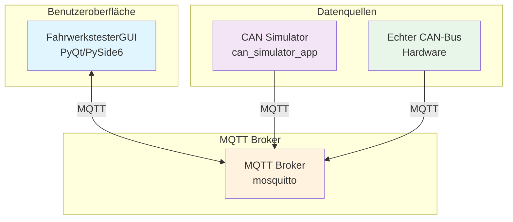
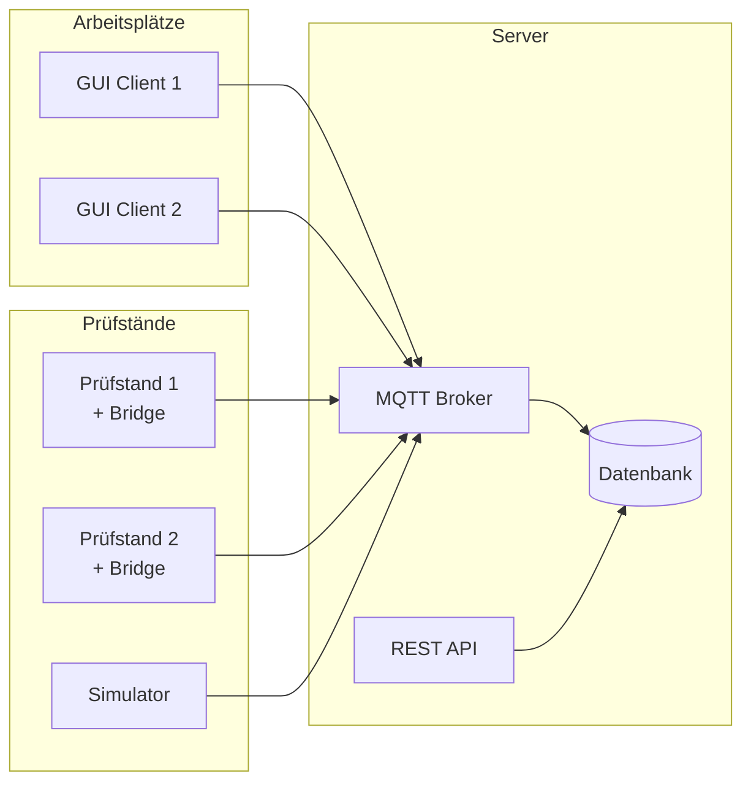

# Fahrwerkstester - Technische Dokumentation v2.0

## Inhaltsverzeichnis

1. [Architekturübersicht](#architekturübersicht)
2. [Komponenten und ihre Verantwortlichkeiten](#komponenten-und-ihre-verantwortlichkeiten)
3. [Kommunikationsarchitektur](#kommunikationsarchitektur)
4. [Projektstruktur](#projektstruktur)
5. [Notwendige Änderungen](#notwendige-änderungen)
6. [Überflüssige Komponenten](#überflüssige-komponenten)
7. [Deployment und Betrieb](#deployment-und-betrieb)

## 1. Architekturübersicht

Das Fahrwerkstester-System besteht aus drei Hauptkomponenten, die über MQTT miteinander kommunizieren:



### Designprinzipien

1. **Lose Kopplung**: GUI kennt die Datenquelle nicht (Simulator oder echte Hardware)
2. **MQTT als Abstraktionsschicht**: Alle Kommunikation läuft über standardisierte MQTT-Topics
3. **Austauschbarkeit**: Simulator und echte Hardware sind vollständig austauschbar
4. **Unabhängige Entwicklung**: GUI und Simulator können separat entwickelt und deployed werden

## 2. Komponenten und ihre Verantwortlichkeiten

### 2.1 FahrwerkstesterGUI (PyQt/PySide6)

**Verantwortlichkeiten:**

- Visualisierung der Messdaten in Echtzeit
- Bewertung nach EGEA-Kriterien
- Benutzerinteraktion (Start/Stop Tests, Radposition wählen)
- Ergebnisanzeige und Protokollierung

**Wichtige Klassen:**

- `FahrwerkstesterGUI`: Hauptfenster mit PyQtGraph-Visualisierung
- `SignalVisualizer`: Optimierte Echtzeit-Signaldarstellung
- `MessageLog`: Strukturierte Log-Anzeige
- `MetricCard`: Wiederverwendbare Metrik-Komponenten

**MQTT-Subscriptions:**

- `suspension/status`: Systemstatus
- `suspension/measurements/processed`: Verarbeitete Messdaten
- `suspension/test/result`: Testergebnisse
- `suspension/gui/command`: GUI-Synchronisation

### 2.2 CAN Simulator App

**Verantwortlichkeiten:**

- Simulation von CAN-Bus-Nachrichten
- Konvertierung CAN ↔ MQTT
- Testdatengenerierung mit konfigurierbarer Dämpfungsqualität
- Bridge-Funktionalität zwischen CAN und MQTT

**Wichtige Klassen:**

- `SimulatorApp`: Tkinter-GUI für den Simulator
- `HybridCanSimulator`: Kombiniert Low-Level-CAN und High-Level-Daten
- `CanJsonConverter`: Konvertierung zwischen CAN und JSON
- `MqttHandler

`: MQTT-Kommunikation

**Simulationsmodi:**

- **Low-Level**: Rohe CAN-Frames (EUSAMA/ASA-Protokoll)
- **High-Level**: Interpretierte Daten (Events, Testergebnisse)
- **Hybrid**: Beide gleichzeitig (Standard)

### 2.3 Echter Fahrwerkstester (Hardware)

**Verantwortlichkeiten:**

- Ansteuerung der Prüfstand-Hardware
- Erfassung von Sensordaten
- CAN-Bus-Kommunikation
- MQTT-Publishing der Messdaten

**Komponenten:**

- `SuspensionTesterService`: Hauptservice für Hardwaresteuerung
- `PhaseShiftProcessor`: Berechnung der Phasenverschiebung
- `EusamaProtocol`: CAN-Protokollimplementierung
- Hardware-Sensoren (Position, Gewicht)

## 3. Kommunikationsarchitektur

### 3.1 MQTT-Topics

```
suspension/
├── status                    # Systemstatus (alle Komponenten)
├── measurements/
│   └── processed            # Verarbeitete Messdaten
├── test/
│   ├── result              # Einzeltestergebnisse
│   └── full_result         # Vollständige Testergebnisse
├── gui/
│   └── command             # GUI-spezifische Befehle
├── simulator/
│   └── command             # Simulator-spezifische Befehle
├── tester/
│   ├── command             # Hardware-Tester-Befehle
│   └── status              # Hardware-spezifischer Status
└── system/
    ├── status              # Systemweiter Status
    └── heartbeat           # Lebenszeichen der Komponenten
```

### 3.2 Nachrichtenformate

#### Messdaten (suspension/measurements/processed)

```json
{
    "event": "test_data",
    "type": "phase_shift",
    "position": "front_left",
    "timestamp": 1234567890.123,
    "platform_position": 512.5,
    "tire_force": 485.2,
    "frequency": 12.5,
    "phase_shift": 42.3,
    "static_weight": 400.0,
    "min_phase_shift": 38.5
}
```

#### Testergebnis (suspension/test/result)

```json
{
    "event": "test_result",
    "position": "front_left",
    "test_method": "phase_shift",
    "timestamp": 1234567890.123,
    "min_phase_shift": 38.5,
    "evaluation": {
        "pass": true,
        "threshold": 35.0
    }
}
```

## 4. Projektstruktur

### 4.1 Hauptprojekt (suspension_tester/)

```
suspension_tester/
├── config/                   # Konfigurationsmanagement
├── lib/                      # Kernbibliotheken
│   ├── can/                 # CAN-Kommunikation
│   └── mqtt/                # MQTT-Kommunikation
├── protocols/               # CAN-Protokolle (EUSAMA, ASA)
├── hardware/                # Hardware-Interfaces
├── processing/              # Signalverarbeitung
├── test_methods/            # Testmethoden
└── service/                 # Hauptservice
```

### 4.2 Simulator-Projekt (can_simulator_app/)

```
can_simulator_app/
├── config/                  # Simulator-Konfiguration
├── lib/                     # Simulator-Bibliotheken
│   ├── can/                # CAN-Simulation
│   └── mqtt/               # MQTT-Handler
├── core/                   # Kern-Simulationslogik
└── simulator_gui.py        # Tkinter-GUI
```

## 5. Notwendige Änderungen

### 5.1 Architekturbereinigung

1. **GUI-Entschlackung**:
    - Entfernen der CAN-Initialisierung in `FahrwerkstesterGUI`
    - Entfernen der direkten Hardware-Abhängigkeiten
    - Fokus nur auf MQTT-Datenverarbeitung

2. **MQTT-Only Interface für GUI**:

```python
class FahrwerkstesterGUI(QMainWindow):
    def __init__(self):
        # NUR MQTT-Handler, kein CAN!
        self.mqtt = MqttHandler

(
            broker=config.get(["mqtt", "broker"]),
            port=config.get(["mqtt", "port"]),
            app_type="gui"
        )
        # Keine CAN-Initialisierung mehr!
```

3. **Standardisierte Datenformate**:
    - Einheitliche JSON-Struktur für alle MQTT-Nachrichten
    - Versionierung der Nachrichtenformate
    - Schema-Validierung

### 5.2 Service-Architektur

Implementierung eines dedizierten Bridge-Services für die echte Hardware:

```python
class HardwareBridgeService:
    """Bridge zwischen CAN-Hardware und MQTT"""
    def __init__(self):
        self.can_interface = CanInterface()
        self.mqtt_handler = MqttHandler

(app_type="bridge")
        self.protocol = EusamaProtocol(self.can_interface)
        
    def process_can_message(self, msg):
        # CAN → JSON Konvertierung
        json_data = self.convert_can_to_json(msg)
        # Publish über MQTT
        self.mqtt_handler.publish("suspension/measurements/processed", json_data)
```

### 5.3 Konfigurationsvereinheitlichung

Zentrale Konfiguration für alle Komponenten:

```yaml
# config/common.yaml
mqtt:
  broker: localhost
  port: 1883
  topics:
    measurements: suspension/measurements/processed
    status: suspension/status
    results: suspension/test/result

# config/gui.yaml
gui:
  update_rate: 50  # Hz
  buffer_size: 300
  
# config/simulator.yaml
simulator:
  sample_rate: 1000  # Hz
  profiles:
    - eusama
    - asa
```

## 6. Überflüssige Komponenten

### 6.1 In der GUI (FahrwerkstesterAppQt.py)

**Zu entfernen:**

- `init_can_interface()` - Methode komplett entfernen
- `can_interface` - Attribut entfernen
- `can_converter` - Nicht mehr benötigt
- `protocol` - Direkte Protokollverwendung entfernen
- Alle CAN-bezogenen Imports

**Zu vereinfachen:**

- `toggle_data_collection()` - Nur noch MQTT-Befehle senden
- Keine direkte Hardware-Initialisierung

### 6.2 Duplikate zwischen Projekten

**Doppelt vorhanden:**

- `MqttClient` und `MqttHandler

` (in beiden Projekten)

- `ConfigManager` (leicht unterschiedliche Versionen)
- `CanJsonConverter` (sollte nur im Simulator/Bridge sein)

**Lösung:** Gemeinsame Bibliothek erstellen:

```
fahrwerkstester_common/
├── mqtt/
│   ├── client.py
│   └── handler.py
├── config/
│   └── manager.py
└── protocols/
    └── messages.py
```

### 6.3 Im Simulator

**Zu konsolidieren:**

- Mehrere Simulatorklassen (CanSimulator, HybridCanSimulator, etc.)
- Redundante Message-Klassen (CanMessage, DummyMessage)

## 7. Deployment und Betrieb

### 7.1 Deployment-Szenarien

#### Entwicklung (Alles lokal)

```bash
# Terminal 1: MQTT Broker
mosquitto -v

# Terminal 2: Simulator
python can_simulator_app/simulator_gui.py

# Terminal 3: GUI
python FahrwerkstesterAppQt.py
```

#### Produktion (Verteiltes System)

```
┌─────────────────┐     ┌─────────────────┐     ┌─────────────────┐
│   Büro-PC       │     │  Zentraler      │     │  Prüfstand-PC   │
│                 │     │  MQTT-Server    │     │                 │
│  GUI-Client     │◄────┤                 ├────►│ Hardware-Bridge │
│                 │     │                 │     │ CAN-Interface   │
└─────────────────┘     └─────────────────┘     └─────────────────┘
```

### 7.2 Betriebsmodi

1. **Simulationsmodus**:
    - Simulator läuft auf beliebigem PC
    - GUI verbindet sich über MQTT
    - Ideal für Entwicklung und Training

2. **Produktivmodus**:
    - Hardware-Bridge läuft auf Prüfstand-PC
    - GUI kann von mehreren Arbeitsplätzen zugreifen
    - Zentrale Datenspeicherung möglich

3. **Hybridmodus**:
    - Simulator und echte Hardware parallel
    - Umschaltung ohne GUI-Neustart
    - Gut für Vergleichstests

### 7.3 Empfohlene Systemarchitektur



Diese Architektur ermöglicht:

- Mehrere GUIs gleichzeitig
- Zentrale Datenspeicherung
- Flexible Prüfstandzuweisung
- Einfache Skalierung